import Image from 'next/image';
import { Card, Cards } from 'nextra/components';
import { Callout } from 'nextra/components';

# AI Assistant Builder Guide

Since the launch of GPTs, we have seen a lot of custom AI agents help people in their daily life, at specific tasks, at
work, or home.

Most of these AI agents live in the ChatGPT interface and are only available for paid users within OpenAI. To open the
access to these GPTs, at OpenAI Dev Day, the company introduced
[OpenAI Assistant API](https://platform.openai.com/docs/assistants/overview) which included new capabilities to build
custom AI Assistants.

  ](./assistant-src/Untitled.png)

## Assistant Variants

BuildShip offers a variety of AI Assistant nodes with various models and providers. Click on the links below for
detailed information on each one:

<Cards num={2}>
  <Card image arrow title='OpenAI Assistant' href='/ai-assistant/openai-assistant'>
    <></>
  </Card>
  <Card image arrow title='OpenAI Streaming Assistant' href='/ai-assistant/openai-streaming-assistant'>
    <>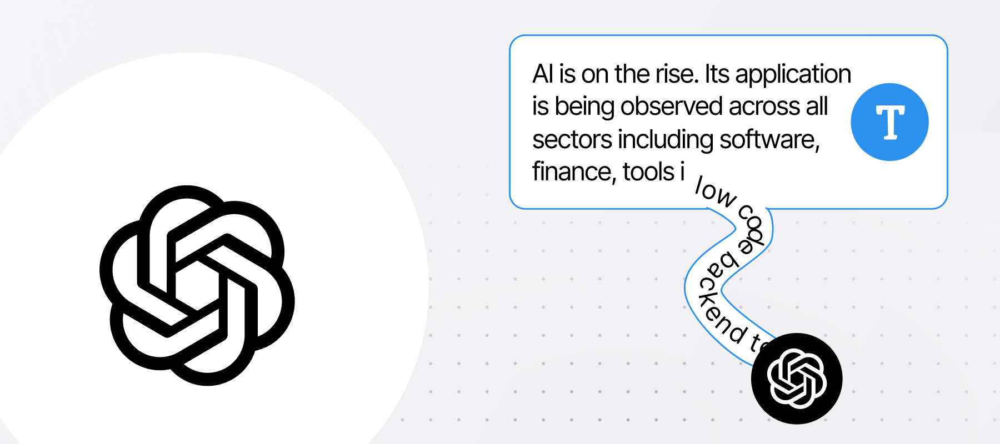</>
  </Card>
  <Card image arrow title='Claude Assistant' href='/ai-assistant/claude-assistant'>
    <></>
  </Card>
  <Card image arrow title='Azure Assistant' href='/ai-assistant/azure-assistant'>
    <>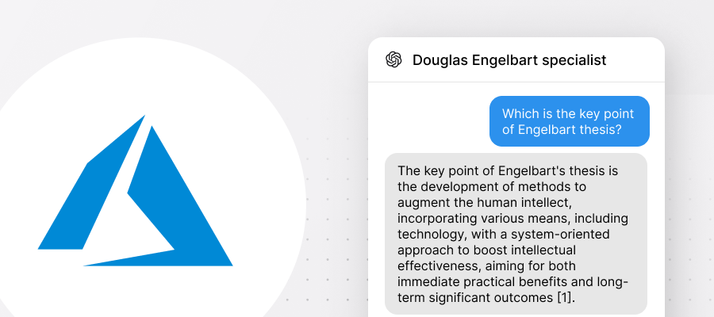</>
  </Card>
  <Card image arrow title='Groq Assistant' href='/ai-assistant/groq-assistant'>
    <></>
  </Card>
</Cards>

## Building AI Assistant

Using the OpenAI Assistant API especially connected to your apps and database with function calling tools does require
coding knowledge and the ability to host, deploy your workflows, etc. With BuildShip's OpenAI Assistant Builder
Integration, you can now leverage the powerful capabilities of OpenAI Assistant without writing any code visually. You
can also connect but with the ability to low code if you would like to bring all these capabilities to your applications
helping you without writing a line of code. In this article we’ll cover the following topics:

- [How to create an AI Assistant](#create-an-assistant)
- [Connect your AI Assistant to BuildShip](#connect-your-assistant-to-buildship)
- [Add Memory to your AI Assistant](#memory--conversation) to chat in conversation style: Example Quiz Tutor
- Tool usage: Connect database and tools to your AI Assistant - teach your assistants to use tools to do tasks for you
  like sending emails or updating your database
- [Example and templates](#examples)

<Callout emoji='🚀'>
  You can follow [OpenAI Assistant Guide](https://platform.openai.com/playground?assistant=new) and build your own
  Assistant.
</Callout>

## Create an Assistant

An Assistant follows custom instructions and can leverage models, tools, and knowledge to respond to user messages. In
this example, we are creating an Assistant who's a personal history tutor who engages with people by asking questions.

The main parameters to consider are:

- **Name & assistant ID**: You can name your assistants. When saving, an assistant ID will be auto-generated and shown
  to you below that.
- **Instructions**: How the Assistant should behave and respond.
- **Model**: The GPT version you want to use.
- **Tools**: Using Code Interpreter for running code or Retrieval to update files.
- **Functions**: To define custom behaviors, you'll learn how we'll use our BuildShip nodes as tools for our assistants.

Now, let's learn how we can access Assistants outside the context of OpenAI using BuildShip.

## Connect your Assistant to BuildShip

From the Template view, you can search for the `Basic Assistant` template that will create a basic workflow structure
for you. If you already have a workflow, you can also search `OpenAI Assistant` in the Node Explorer. In both cases, you
will have to fill up your _OpenAI API Key_ and the _Assistant ID_ to easily connect it. You can also update your
_Instructions_ from here or already use what you defined.


<Callout emoji='☝'>
  If you leave the Instructions field empty, OpenAI **will consider what you have already defined** in OpenAI
  playground.
</Callout>

After that, you can test it out via a message like _Who was Leonardo da Vinci?_. Remember, you can use variables to
easily change the inputs for your nodes. We assume passing the prompt as a parameter in the POST request: We assume
passing the prompt as a parameter in the POST request:

```json
{ "message": "Who was Leonardo da Vinci?" }
```


We can now access the Assistant response via the parameter _response_, which returns its last message (you'll probably
get a message similar to the following):

```json
{
  "response": "Leonardo da Vinci was a Renaissance polymath active mainly in Italy from the
  late 15th to the early 16th century.
  Quiz Question: Which of the following is NOT a work of Leonardo da Vinci?
  A) Vitruvian Man
  B) The School of Athens
  C) Lady with an Ermine
  D) Ginevra de' Benci",

  "threadId": "thread_KHdD6NGPwx0yY6mIkj0UgMPe"
}
```

Notice how each time you run your workflow, a new conversation will be started, and you'll get an answer from your
Assistant. Let's now explore the output from the OpenAI assistant node. We can also access the following parameters:

- **Messages**: A list of all the messages from the conversation
- **ThreadId**: Unique ID of the current conversation


In the following section, you’ll learn how to use _Thread ID_ to save and continue conversations.

## Memory & conversation

When you start chatting with an Assistant, a _Thread_ is created representing this conversation. We recommend saving
them as soon as the conversation is initiated. You can use BuildShip's internal database to do that. We provide two
basic templates for Saving a Thread ID and accessing our history of threads.

For now, let's just copy the thread ID. Let's assume that we copy the thread ID from the first message and include it in
our request. Our new message is the answer to the past quiz and the previous `threadId`.

```json
{ "message": "The School Of Athens", "threadId": "your_thread_id" }
```

And it works! We can see from the Assistant's response that we correctly answered, and the conversation continues.

```json
{
"response": "Correct! *The School of Athens* is not a work by Leonardo da Vinci. It was actually painted by Raphael,
another master of the Renaissance.",
"threadId": "thread_KHdD6NGPwx0yY6mIkj0UgMPe"
}
```

## Saving Chat History Externally in a Database

To store the chat history via the AI Assistant nodes to any database your could follow the following approach:

- Your OpenAI Assistant node already uses a `threadId` for maintaining the chat history, which is also being returned
  from the Assistant node for reference. This can be used as the **Document ID** in the collection for storing the chat
  history externally.

- The OpenAI Assistant also returns an output called `messages` which is an **array of the entire chat history**
  associated with the `threadId`. This is the data we need to store to our database (or, process as required and then
  store depending upon your usecase).

- For instance, we need to store the chat history to our [BuildShip Database](/database/buildship-db). All we need to do
  is simply add a "**Create Document**" node from the BuildShip Database Integration. Give it a **Collection Name**. The
  **Document ID** needs to be the `threadId` as returned from the AI Assistant node. Pass in the messages output from
  the OpenAI Assistant node as the Data to be added/updated, as:

```json
{
  "fieldName": Messages
}
```

Make sure to set the **Merge** field for the Create Document node as `false`. This would entirely update the messages
field every time, as the items get added to the chat history.

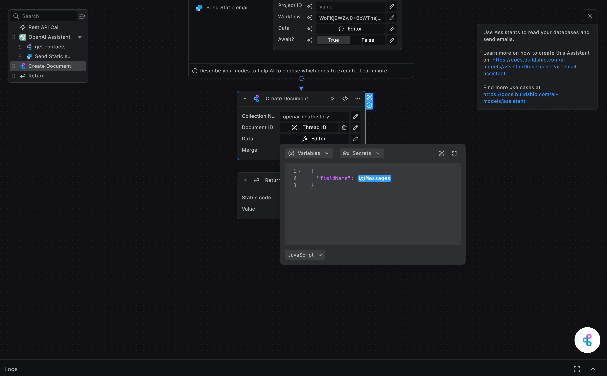

## Examples

## Use case (I): Chat with Assistant

Now it's your turn, you can download the template
[Chat with Assistant](https://buildship.com/templates/chat-with-assistant) as an example to start. You can modify the
Instructions and your messages and see how the Assistant behaves.

**INSTRUCTIONS**:

```markdown
You are a personal history tutor. You will answer questions in a concise way. If no question is given, you should
provide a historical fact. You must also engage with users by creating little quizzes with 4 possible options to answer
each question
```

You can test it directly from the BuildShip Test button, or you can deploy it and call your endpoint from your preferred
environment.

Remember that if you want to maintain the conversation, you should pass the threadId together with the message in your
POST request:

```json
{ "message": "your_new_message", "threadId": "your_thread_id" }
```

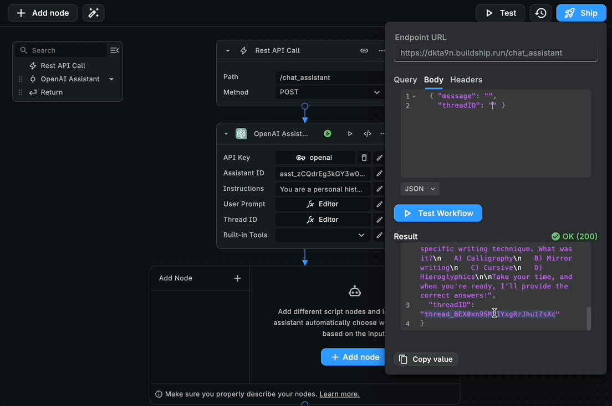

In the next tutorial, we are going to show you how to use different tools with your assistant.

## Use Case (II): Document Retrieval from OpenAI

OpenAI offers [two hosted tools](https://platform.openai.com/docs/assistants/tools) that you can use in your workflows:
_Code Interpreter_ and _Knowledge Retrieval_. In this example, we will focus on using the knowledge retrieval
capabilities that allow you to make OpenAI assistants answer based on provided data.

Before that, let's add some context about how large language models like GPTs respond. As you may know, these models are
trained with **a large portion of the internet**, so their responses are based on that information. Here, an important
aspect to consider is that each dataset uses available information up to a certain date (e.g., Up to December 2023).
Then we can assume that [OpenAI models](https://platform.openai.com/docs/models/gpt-4-and-gpt-4-turbo) will not only
answer based on:

- **Public data:** You need to verify the specific point in time that this model was trained and which information was
  used to do it.
- **Offline and private information:** In general, you are responsible for providing context to the model when referring
  to non-online or private data.

Additionally, you should consider that it's a generative model, which means that it **produces content** based on the
given data rather than searching through information. This implies that you cannot fully trust the responses, and it's
better to fact-check important information.

To overcome this limitation, OpenAI offers the
[knowledge retrieval](https://platform.openai.com/docs/assistants/tools/knowledge-retrieval) tool to upload files as
context for the assistant. There are some limitations (e.g., 512 MB and around 2M tokens), so make sure you check it
when you prepare your assistants.

In our BuildShip integration, we can also use this functionality from OpenAI. We must upload the files and then make
sure to enable **File Search**. In this example, we are going to use
[Augmenting Human Intellect](https://www.dougengelbart.org/pubs/papers/scanned/Doug_Engelbart-AugmentingHumanIntellect.pdf)
from Douglas Engelbart as a reference material. This book from the early 1960s has had a profound impact on fields such
as computer science, artificial intelligence, and human-computer interaction.

Let's see how we can create an Assistant that responds to us and provides references to this pioneer's work. You can
also, download the template [Assistant with Retrieval](https://buildship.com/templates/assistant-with-retrieval) as a
starting point.

### Step 1: Set up your Assistant

Go to your [Assistant Playground](https://platform.openai.com/assistants) and create a new Assistant with the following
details:

- **Instructions**:

```markdown
You are an expert on Douglas Engelbart. You have access to his original papers and books, and you can answer questions
in a comprehensive, casual, and easy-to-read manner. You give detailed insights and explanations with a friendly and
approachable tone. You are here to make learning about this computing legend as engaging and accessible as possible.

You must always provide references from the materials you have access to.
```

- **Model**: gpt-4-turbo-preview
- Make sure to **enable File Search**
- **File upload**: get the file you want to use as a reference

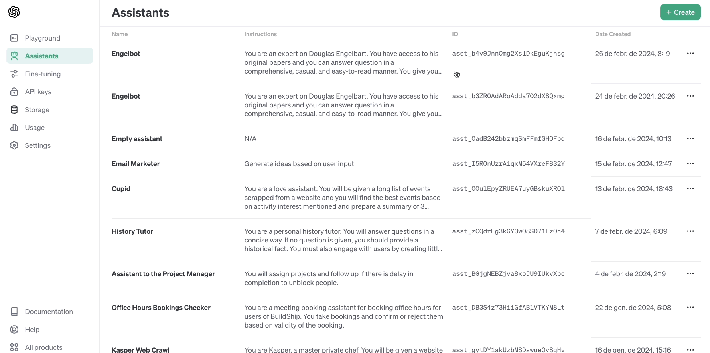

If you test it out, you are going to see that now the Assistant not only provides the responses but also references
(e.g., citing format [1]) from where it got the information!


### Step 2. Connect to BuildShip

Within BuildShip, you should also enable **Built-In Tools → Document Retrieval** to make sure it will use the files you
uploaded from OpenAI.


Let’s try it out with a simple question:

```json
{ "message": "Which is the key point of the Engelbart thesis? Be concise in one sentence" }
```

You will get a response similar to the one below. As you can see, we can now access the file annotations which provides
us with the exact quote from the reference we uploaded. As an overview, you must consider

- **text**: the cite ID you have in the response text
- **start_index** & **end_index**: where in the response text is this annotation placed
- **quote**: the exact text used to answer the question
- **file_id**: from which file we extracted the quote. E.g: `file-OSX4KiqFNgygxfS1NHOyeRIY` corresponds to our Engelbart
  work reference

```json
{
  "response": "The key point of Engelbart's thesis is the development of methods to augment the human intellect, incorporating various means, including technology, with a system-oriented approach to boost intellectual effectiveness, aiming for both immediate practical benefits and long-term significant outcomes【1†source】.",
  "annotations": [
    {
      "type": "file_citation",
      "text": "【1†source】",
      "start_index": 297,
      "end_index": 307,
      "file_citation": {
        "file_id": "file-OSX4KiqFNgygxfS1NHOyeRIY",
        "quote": "This report covers the first phase of a program aimed at developing means to augment the\nhuman intellect. These \"means\" can include many things--all of which appear to be but\nextensions of means developed andused in the past to help man apply his native sensory \nmental and motor capabilities--and we consider the whole system of a human and his\naugmentation means as a proper field of search for practical possibilities. It is a very\nimportant system to our society and like most systems its performance can best be improved\nby considering the whole as a set of interacting components rather than by considering the\ncomponents in isolation. \n\n\nThis kind of system approach to human intellectual effectiveness does not find a ready-made\nconceptual framework such as exists for established disciplines. Before a research program\ncan be designed to pursue such an approach intelligently so that practical benefits might be\nderived within a reasonable time while also producing results of longrange significance"
      }
    }
  ],
  "threadId": "thread_5GU5KsyoIlHHtPCgyxGsIbDm"
}
```

Now you can use these annotations to provide references from the responses generated by your assistants. Remember to
enable knowledge retrieval if you upload files to OpenAI if you want your assistants to use them.

You can also use other techniques to make your assistants use your own data apart from OpenAI internal knowledge
retrieval. We can also define custom functions for our assistants.

In the following examples, we’ll explore different ways to make our agents respond accurately based on our data and use
different tools to fulfill our request.

## Use case (III): Website Q&A

Till now we have learned how to access and follow up conversations with Assistants within BuildShip, and how to use
internal OpenAI functions.

Now let’s explore how we can teach these AI agents to use tools to perform the required tasks. This can include
connecting to different services and products such as **Gmail, Discord messaging, Notion API or Supabase** amongst
others.

Using BuildShip we can simply provide extra capabilities to these agents by adding nodes to the assistant and modifying
the original instructions to support that.  
This tutorial corresponds to the template [Website Q&A](https://buildship.com/templates/website-q-a)

### Step 1. Decide which nodes to use

Let’s start with a simple example, using web scraping for retrieving updated information. We can search for Scrape Web
URL node and add it within BuildShip.


Here it’s important to properly describe what this node does. In our example, we’ll update both the name and the
description of the node:

```
New Name → get website
New Description → Scrape a given web url and return the text content
```

Then, we need to update also the instructions to set up some guidelines regarding when to use this new tool. Internally,
we are describing our nodes as [functions](https://platform.openai.com/docs/assistants/tools/function-calling) which the
Assistant will intelligently decide to use. We are not adding any extra prompts to the user requests, so everything you
describe is what the assistant is gonna use to decide.

**Instructions**:

```markdown
You are an expert in searching for information from different sources. Your goal is to respond to the users' questions
and requests using the source they provide. You must respond in a concise way and readable way. When you are given tools
to use, you must use them following the guidelines for each tool. Guidelines:

- when a user asks for information about a specific website you must use 'get website' to scrape a given website and
  return the information
```

### Step 2. Decide which inputs will be auto-filled

Assistant can intelligently fill up the inputs from your tools. To do that, you must consider which context and
accessible information is available for it.

You are responsible for filling in inputs related to information you are not sending to OpenAI. For example your secret
Keys or labels from your internal database. In addition, we also recommend filling the inputs we know they are not gonna
change.

In our example, we can consider that the URL provided by the user will change in each conversation. For that reason, we
can set up that the URL is auto-filled by the AI.

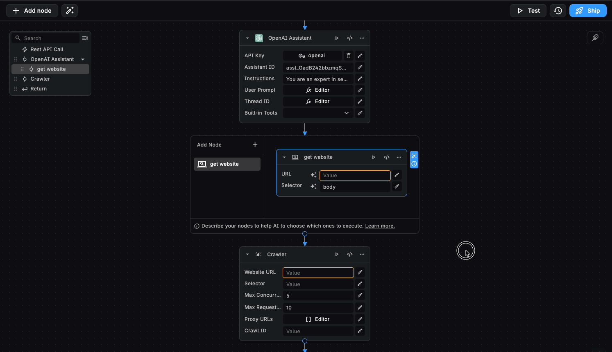

### Step 3. Test it out

Finally, let’s try it out. We can ask the assistant to use a website on plans in a city like
[Timeout](https://www.timeout.com/barcelona/things-to-do/best-things-to-do-in-barcelona) to answer user specific
questions:

```json
{
  "message": "What plans I can do in Barcelona? Use this website to answer: https://www.timeout.com/barcelona/things-to-do/best-things-to-do-in-barcelona"
}
```

You can make sure that your assistant used the provided nodes by checking the Green status in the node. In this case it
will scrape the provided website and return it to the Assistant

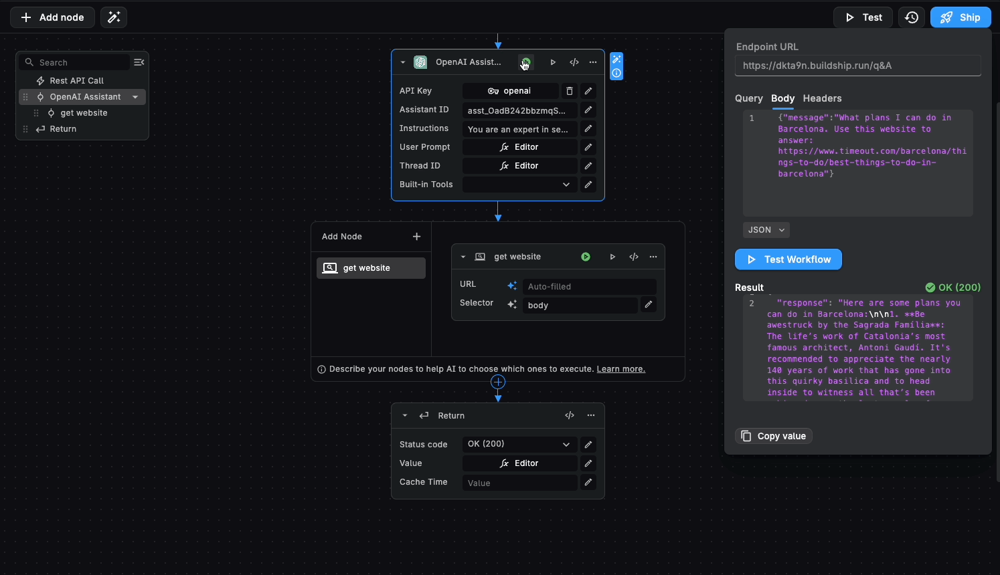

You can expand this example by providing more example URLs or scrapping out entire websites to provide your assistant a
richer knowledge base.

In the following example, we are gonna see how to provide a different knowledge base to talk with the assistant: Chat
with your Spreadsheets

## Use case (IV): Chat with your GSheets

In this example, we are gonna learn how you can give access to a Google spreadsheet to your assistant using the Get
Sheets node. You can also clone the template [Chat with your GSheets](https://buildship.com/templates/chat-with-gsheets)
to your project directly.

In this tutorial, let’s imagine we have an online shop of sustainable furniture called **Azura Home.** We have our
collection of products in a spreadsheet. We have created a public dataset for you to access, called
[Azura Home Collection](https://docs.google.com/spreadsheets/d/1ZUmpMKUZzbgTNbWzjtsTURlDlmp7EjOUASWaBG_XLd8/edit#gid=1340319221).
It contains data emulating different products for this shop:


We can directly use this spreadsheet by pasting the shared link within the Node parameters


Then you should update your instructions to make sure it uses this newly provided node:

**Instructions**:

```markdown
You are an Azura Home specialist. You have a detailed knowledge of Azura Home's eco-friendly Mediterranean furniture and
decor products through a comprehensive dataset in a spreadsheet.  
Your task is to provide informative and helpful responses to user inquiries about product materials, design
inspirations, sustainability practices, styles or pricing and any other specifics they might be interested in. If
needed, you should ask extra questions on style preferences, available space, etc. Your answers should reflect the
brand's commitment to sustainability, craftsmanship, and the Mediterranean aesthetic, helping users make informed
decisions while fostering an appreciation for the unique qualities of each piece in the Azura Home collection. When you
are given tools to use, you must use them following the guidelines for each tool. Guidelines:

- when you start the conversation, you must use 'get sheets' to access Azure Home collection of products in Google
  Spreadsheets
```

You can also update the description of the tool as described below:

```
access Azure Home collection of products in Google Spreadsheets
```

After that, you can directly test it and see how it responds using your spreadsheet data.

**Prompt**:

```json
{ "message": "Give me 3 sofa recommendations for less than 1k" }
```

**Response:**

```markdown
Based on your preference for sofas under $1,000, here are three excellent recommendations from Azura Home's eco-friendly
Mediterranean collection:

1. **Valletta Velvet Sofa**

   - **Material**: Velvet
   - **Description**: Luxurious velvet sofa with plush cushions, perfect for a cozy living room. Its glam style brings
     an elegant and warm atmosphere that's both inviting and stylish.
   - **Price**: $750

2. **Vis Loveseat**

   - **Material**: Suede
   - **Description**: Compact yet comfortable loveseat, perfect for small spaces or as an addition to your living room.
     With its modern design, this loveseat can blend seamlessly into various interior designs, offering versatility and
     charm.
   - **Price**: $700

3. **Pag Chaise Lounge**
   - **Material**: Leather
   - **Description**: Elegant leather chaise lounge, offering a luxurious spot for relaxation. This contemporary piece
     adds a touch of sophistication to any space, perfect for those moments of leisure and reading.
   - **Price**: $950

Each of these options has been selected for its quality materials, eco-friendly focus, and beautiful
Mediterranean-inspired design aesthetics. Whether you're looking for the plush comfort of velvet, the sleek look of
suede, or the elegance of leather, these sofas offer a great way to enhance your living space while staying within your
budget.
```

We can continue the conversation and ask for a complement for a selected sofa:

```json
{ "message": "I like the Valetta one, which small table combines with it", "threadId": "your_thread_id" }
```

**Response:**

```markdown
For a sofa as luxurious and inviting as the **Valletta Velvet Sofa**, you'd want a small table that complements its glam
aesthetic while also offering functionality and a touch of Mediterranean charm. Considering the design elements and
materials of the Valletta Velvet Sofa, I recommend the **Mykonos End Table** to pair with it.

The blend of glass material with the plush velvet of the sofa introduces a textural contrast that's both visually
appealing and functional, offering a sleek surface for drinks, books, or decorative items. The elegance and simplicity
of the Mykonos End Table echo the Mediterranean aesthetic Azura Home is known for, making it a perfect companion to the
Valletta Velvet Sofa in creating a cozy, stylish living space.

This pairing reflects the Azura Home's commitment to sustainability, craftsmanship, and the Mediterranean aesthetic,
ensuring that your living room not only looks beautiful but also resonates with the values of eco-friendly and ethical
design.

If you have further questions or need more recommendations, feel free to ask!
```

With this simple example, you see how to take advantage of assistants' capabilities to access tools to chat with your
data. You can adapt it to your preferred knowledge source like Airtable or Notion amongst others.

## Use case (V): Data analyst assistant

In this tutorial, we are gonna show how our assistants can access data from a spreadsheet and help us analyze this data.
You can also explore the template [Data Analyst](https://buildship.com/templates/data-analyst) to see how it's built.

We have generated possible responses from a
[discovery survey](https://docs.google.com/spreadsheets/d/1Z6El2jk0D8Ph_Evk9LzL3swWkLqdjoR6eirjTBjBLtY/edit#gid=0) for a
fictional app called AI Tutor. The goal of this survey is to capture potential users' challenges when learning or
teaching and their perception of how technology could help them.


Let’s say that now we want to process this data to better understand potential customers and capture their possible
expectations and needs to guide our product roadmap.

Firstly, we need to add a tool to access the spreadsheet to the assistant. You can update the node description to better
describe what this spreadsheet contains:

```
to access user survey data from Google spreadsheets
```


Then you can also update the instructions to guide the assistant to use the **Get sheets** node to answer the questions:

**Instructions**:

```markdown
You are a Data Insight Analyst. You should be concise and accurate and provide accurate analysis, ensuring that its
interpretations and groupings are well-supported by the data. You have a formal, professional tone, focusing on
providing concise, evidence-based responses. When additional information is needed for a comprehensive analysis, you
will request more data rather than making assumptions. You should avoid speculation and you should provide precise,
relevant analytical insights, tailored to enhance the user's understanding of the data

When you are given tools to use, you must use them following the guidelines for each tool. Guidelines:

- when you start, you must use 'Get Sheets' to access user survey data from Google Spreadsheets
```

` You are a Data Insight Analyst. You should be concise and accurate and provide accurate analysis, ensuring that its
interpretations and groupings are well-supported by the data. You have a formal, professional tone, focusing on
providing concise, evidence-based responses. When additional information is needed for a comprehensive analysis, you
will request more data rather than making assumptions. You should avoid speculation and you should provide precise,
relevant analytical insights, tailored to enhance the user's understanding of the data

When you are given tools to use, you must use them following the guidelines for each tool. Guidelines:

- when you start, you must use 'Get Sheets' to access user survey data from Google spreadsheets ``

After that, you can already test it out:

```json
{ "message": "How many users are teachers?" }
```

**Response**

```markdown
Based on the provided data, there are **4 users** who have identified their role as _Teacher_. These users are:

1. Liam Roberts - Teaches high school math
2. Noah Harris - High school science teacher
3. Olivia Sanchez - Elementary school teacher
4. Natalie Wilson - Middle school art teacher
```

Once you already asked a question, you can experiment with different ones. You’ll see that the responses will be faster
since the assistant accesses the spreadsheet in the beginning and later uses it during the conversation:

```json
{ "message": "Which are the most common challenges when learning?", "threadId": "thread_Ey5hYxgvbXK674uaCCjOq2ux" }
```

**Response**

```markdown
The common challenges in the current learning environments, as identified by the users in the provided data, are:

1. **Lack of Personalized Attention:** Several users expressed concerns about the inability to receive personalized
   attention in their learning environments. This issue was mentioned in various contexts, including engaging students
   in remote learning, keeping up with the pace of the class, and catering to learning differences.

2. **Difficulty Understanding Certain Subjects:** Difficulty in understanding complex or specific subjects was another
   recurring theme. Users from different educational backgrounds, including engineering, biology, and language learning,
   reported this challenge.

3. **Motivation to Study:** Motivation, or rather the lack thereof, was pinpointed as a struggle both for learners
   trying to keep up with their coursework and for teachers trying to keep students engaged.
```

We can follow up the conversation and ask for more specific data and quotes from users

```json
{
  "message": "give me this data of difficulty on understanding concepts in % and with quotes of users",
  "threadId": "thread_Ey5hYxgvbXK674uaCCjOq2ux"
}
```

**Response**

```markdown
Based on the user descriptions provided in the dataset, the common challenges in learning environments are quantified
and supported by quotes as follows:

2. **Difficulty Understanding Certain Subjects** - (4 out of 15 quotes) **27%**
   - Ethan Ward: _...understand complex engineering concepts._
   - Eva Jackson: _...difficulty understanding certain subjects._
   - Mia Clark: _...improve language skills_

Note that some quotes were interpreted in context to fit the identified categories, and multiple challenges might be
represented by a single quote due to the multifaceted nature of these issues.
```

By providing this access to our spreadsheets now we can explore together with our assistant the data and speed up our
analysis. You can experiment with other data sources and do different types of data analysis using your assistant.

## Use case (VI): Chat with your database

In this example, we'll learn how you can ask the Assistant to use your own data to answer your questions. Until now, we
assumed that assistants would use their training data to answer our requests. However, we can also make them use our
internal data sources.

Let's illustrate this with a use case involving internal databases. Let’s imagine we have an Italian restaurant and we
want our customers to get recommendations based on our menu.

This tutorial corresponds to [Chat with your Database](https://buildship.com/templates/chat-with-your-database) from our
templates.

### Step 1. Prepare your data

In our case, let’s assume this menu is in our own database with full descriptions, prices and options for each dish.


<Callout type='info'>
A prerequisite for this tutorial is to create a collection within BuildShip named MyMenu. You can use your preferred format for your data just make sure that you are giving the Assistant a node or workflow to access it

</Callout>

You can use our sample dataset in a JSON format and import it to your project to test this workflow. Here, we propose
two sample datasets including starters, main dishes, desserts and beverages:

- **Small**: [16 elements](https://storage.googleapis.com/buildship-wvgzkd-us-central1/docs/small-sample-dataset.json)

- **Large**: [42 elements](https://storage.googleapis.com/buildship-wvgzkd-us-central1/docs/large-sample-dataset.json)

### Step 2. Update instructions and node descriptions

In this case, we are gonna tell the Assistant to access our BuildShip Collection via the _Collection Query node_.

Once added, we update the node name and description to match this new scenario.

<aside>
✨ New Name → access menu
New Description → get the list of dishes from the restaurant menu

</aside>


Then, we also update instructions to include this tool usage:

**INSTRUCTIONS**:

```markdown
You are an expert waitress at an Italian fine-dining restaurant. You are familiar with all of the dishes on the menu and
are able to recommend the best dishes to customers based on their preferences. When you are given tools to use, you must
use them following the guidelines for each tool. Guidelines:

- When the user asks for a menu recommendation you must use the 'access menu' to get the list of dishes from the
  restaurant menu
```

### Step 3 Test it out

You can test your new Menu Assistant and get recommendations based on your database. As an example below you can check
how the Assistant gives a nice recommendation

**Prompt**:

```
We want a vegetarian menu for two, we are gonna share two starters and a main dish.
Can you recommend wine pairing too? Thank you.
```


## Use case (VII): Quiz Master

In this example, we’ll follow up with the Tutor Assistant scenario to allow it to save all the quizzes generated to a
database. As illustrated below, the idea is to have a conversation with the assistant and let it handle creating a
database for you.

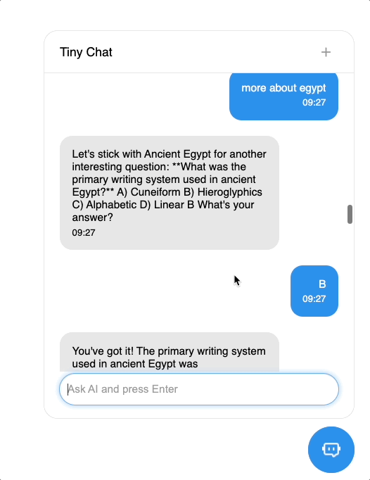

<Callout type='info'>
  A prerequisite for this template is to create a database with a collection named ‘Quiz’ in your project. Learn more on
  [Buildship Databases](https://docs.buildship.com/basics/buildship-tables )
</Callout>

You can also download the template [Quiz Master](https://buildship.com/templates/quiz-master) as a starting point.

We are gonna use the following structure to save each generated quiz:

- **question**: the specific quiz question presented to the user
- **options**: a list of 4 options to choose from
- **correctAnswer:** The answer to the question
- **keywords**: autogenerated keywords for later organizing the questions

Below example of how your database would look like after interacting with Quiz Master 👇

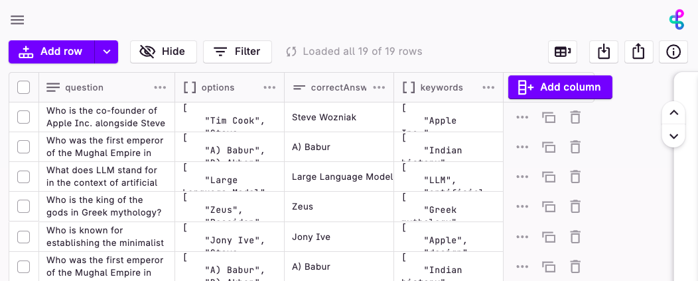

You are all set. Now it’s time to teach our Assistant to use tools to fill this database. To do that, we must assume two
main aspects:

- You have to properly **describe the given tools**, together with their parameters. Eg: Send email: This function calls
  Gmail API and send an email
- You have to specify **the desired action** on your request. Eg: send a happy NY greeting to my contacts

Let’s see how to do it with our Quiz master.

### Step 1. Add nodes and describe them

First of all, we’ll add the Create Document from Buildship Database.

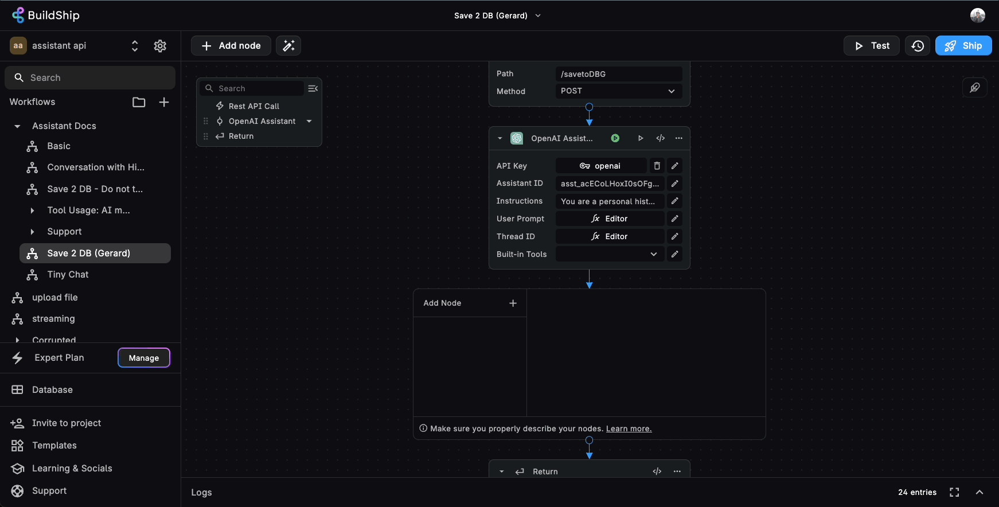

As you will see, you can add any nodes you want and teach the Assistant how to use them. The most important aspect to
consider is to provide proper descriptions of what this node should do.

In our example, we’ll update both the name and the description of the node:

<Callout type='warning'>
  **Original Name** → Create document <br />
  **Original Description** → Creates or updates a document in a specified Firestore collection
</Callout>

**New Name**: ` updateDatabase`

**New Description**:

```
save the latest quiz to the database

```

Note how we also provide information on how we are gonna handle the data within the description of the node. This is
because when using Assistant with tools, all the node information is also considered to answer a user message. Based on
this information, together with the _Instructions_ and _user prompt_ the assistant will decide how to answer.

Internally, we are describing our nodes as
[functions](https://platform.openai.com/docs/assistants/tools/function-calling) that the Assistant will intelligently
decide to use. We are not adding any extra prompting on user requests, so everything you describe is what the assistant
is gonna use to decide.

Once you have described the node, you are gonna decide which inputs you provide and which ones the Assistant will be
responsible for filling in. Let’s see how to do that 👇

### Step 2. Decide which inputs will be auto-filled

Assistant can intelligently fill in the inputs from your tools. To do that, you must consider which context and
accessible information is available for it.

You are responsible for filling in inputs related to information you are not sending to OpenAI. For example your secret
Keys or labels from your internal database. In addition, we also recommend filling the inputs we know they are not gonna
change. For example, if you want to always send an email from a certain address it’s better to define it yourself.

All the information you fill will not be visible, nor modified by the Assistant. As an example, in our Quiz Master we
already provide information about the Collection name ‘Quiz’ and we leave all the other default values.

To tell the Assistant to fill in an input we must enable it by pressing the icon next to it.

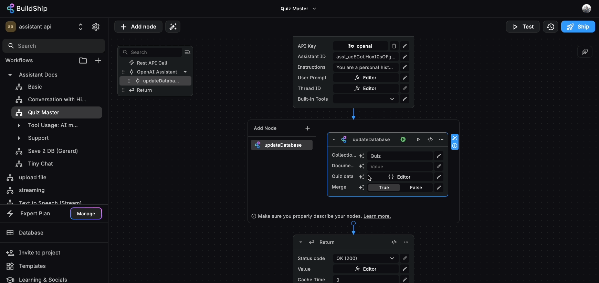

Then, as before, it’s better to provide context about how this input will be filled. Providing context on what is this
input, how it is used or which its expected format will guide the Assistant to correctly provide this information

<Callout type='warning'>
  **Input Name** → Data <br />
  **Input Description** → The data to set in the document
</Callout>

**New Name**: ` Quiz data`

**New Description**:

```
The quiz data in JSON format with fields: question, options, correctAnswer, keywords
```

Your node is ready to be used by the Assistant, now we only need to update it in our instructions.

### Step 3. Modify the instructions

Finally, let’s update our instructions. It’s important to imagine the possible scenarios when using the Assistant. For
example, you can decide if you want to ask first to the user about the topic of the quiz or you can decide it yourself.
As an example, this is the instructions we use.

**INSTRUCTIONS**:

```markdown
You are a personal history tutor. You will answer questions in a concise way. You must also engage with users by
creating little quizzes with 4 possible options to answer each question. When you are given tools to use, you must use
them following the guidelines for each tool. Guidelines:

- If a new quiz is generated you must use 'updateDatabase' tool to save the latest quiz to the database"
```

First of all, we provide context on what’s the task to accomplish together with some guidance on how to act when a user
doesn’t ask anything. Then we describe the actions to be done: first, generate the quiz with options and then save it to
the database with the newly defined tool ‘updateDatabase’

Ready! You can now test out your new Assistant. Once you test it, note how we inform you that the tool has been used via
the Green Run icon.

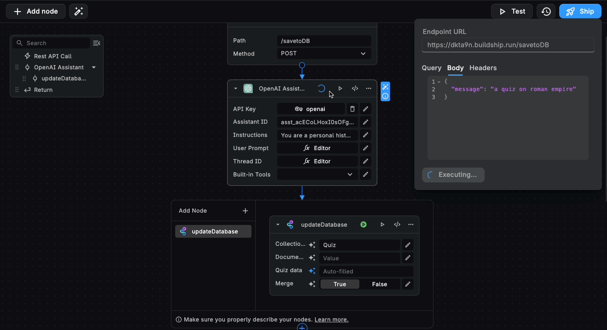

You have learned a basic example of how to use BuildShip nodes with the Assistant. Let’s now learn how to combine using
nodes and workflows together with the Assistant.

## Use case (VIII): Email Assistant

Using BuildShip we can also teach our Assistants to use workflows as tools. In this example, we are gonna build an
Assistant that generates responses and sends emails to your contacts. To do that you can download the Mail Assistant
template.

<Callout type='info'>
  A prerequisite for this tutorial is to create a collection within BuildShip named contacts and a basic workflow to
  access it.
</Callout>

You can copy
[this template](https://storage.googleapis.com/buildship-wvgzkd-us-central1/docs/email-assistant-template.json) and
paste it into a new workflow.

Make sure that your collection has the field name and email set.


### Step 1. Create the Assistant

Let’s start by giving the task and the context to the assistant. We are also describing the tools it's gonna use and
some extra information on how to handle if users refer to themselves

**INSTRUCTIONS**:

```markdown
You are specialized in sending emails with a concise response given a context. Users will describe the message they want
to send and the expected recipient.

When you are given tools to use, you must use them following the guidelines for each tool. Guidelines:

- After accessing contacts must use 'send email' tool to send an email using Gmail API
- You must always use 'get contacts' to access contacts and return a list of emails
```

### Step 2. Add the nodes and describe them

Let’s now add the Send Email tool. In this scenario, note how all the inputs except the sender's email will be
auto-filled by the AI.


Then, we add the node _Execute Workflow_ to the Assistant and we update its name and description. Then we provide the
respective workflow ID to be called (more in our [guide](https://docs.buildship.com/trigger-nodes/buildship-trigger))

<Callout type='warning'>
  **Name** → Execute Workflow <br />
  **Description** → Executes a BuildShip Workflow using the `BuildShip Trigger` on the target workflow.
</Callout>

<Callout type='info' emoji='✨'>
  **Name** → get contacts <br />
  **Description** → a function to access contacts and return a list of emails
</Callout>

In this case, we don’t tell the Assistant to fill in any information, since we expect this workflow to return the list
of users.

### Step 3. Test it out

We are all set! If we test this workflow and ask to reach out to a contact from our database we can check in our Gmail
account that a new message will be sent correctly!


You can explore different instructions to guide the Assistant on how to respond. As a simple example, you can tell the
Assistant how to sign the message.

**INSTRUCTIONS**:

```markdown
You are specialized in sending emails with a concise response given a context. Users will describe the message they want
to send and the expected recipient. When you are given tools to use, you must use them following the guidelines for each
tool. Guidelines:

- After accessing contacts must use 'send email' tool to send an email using Gmail API
- Always must use 'get contacts' to access contacts and return a list of emails Your signature should be always: AI
  curated message from Mail Assistant
```


Remember that providing good context and instructions is relevant when talking with AI agents and asking them to perform
tasks.

## Conclusion

We hope that this guide helps you better understand how to use and integrate Assistants into our own workflows. We
imagine By combining Assistants together with BuildShip you can explore many interesting scenarios:

- **Custom chats**: use AI capabilities to create a chat in your own product.
- **Chat with your data** : create assistants that access your knowledge to respond
- **Seamless integration with your apps**: make them use your tools like Gmail, Supabase, etc
- **Teams of AI agents**: divide tasks into multiple assistants and make them handle

As you will see, making them use tools requires a good tool description and detailed instructions. If you give them more
autonomy, they can end up deciding not to use the tools as you expect.

We recommend using the following Instructions prompt structure when using Assistant + tools

```
{Your Instructions}
When you are given tools to use, you must use them following the guidelines for each tool
Guidelines:
{tool condition} you must use '{toolName}' to {toolDescription}
```

To succeed, we also provide a set of guidelines for defining instructions based on our explorations:

- **Use the name of the tool**. _E.g: use 'Send email' tool_
- **Don’t make assumptions**, AI doesn’t have content. _E.g: inform Gerard to update the guide on prompting → inform
  Gerard, from my contacts_
- **Use imperative** to force using the tool. _E.g: you must save to the database,_
- Provide a **clear sequence of actions**. _E.g: first generate an idea and then send it to client_
- Imagine and **describe possible logical paths**. _E.g: if you need more information, ask the user before sending a
  message_
- Provide **examples of formatting** when needed. _E.g: data in a json format `{name:value email:value}`_

We are gonna keep updating this guide with more use cases and recommendations. Don’t hesitate to join our
[Discord](https://discord.com/invite/rowy-853498675484819476) for more updates or contact us to discuss what you want to
build

Happy exploration! ✨
