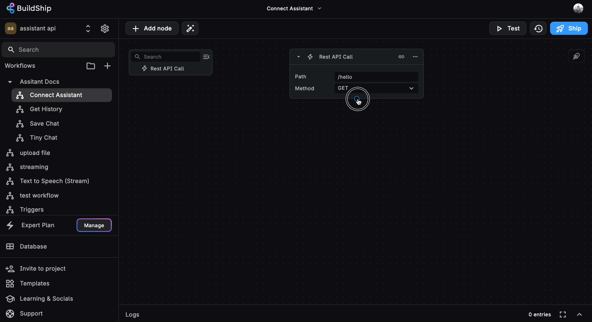
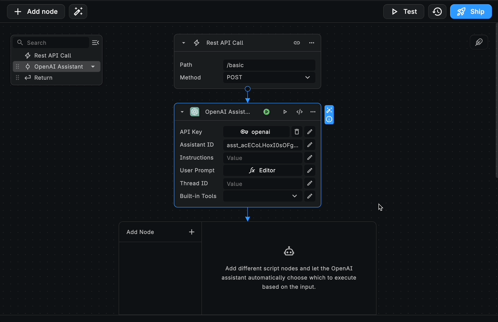
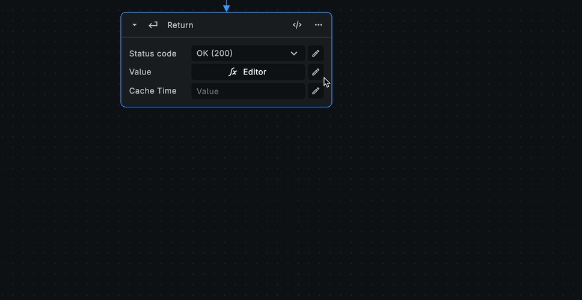
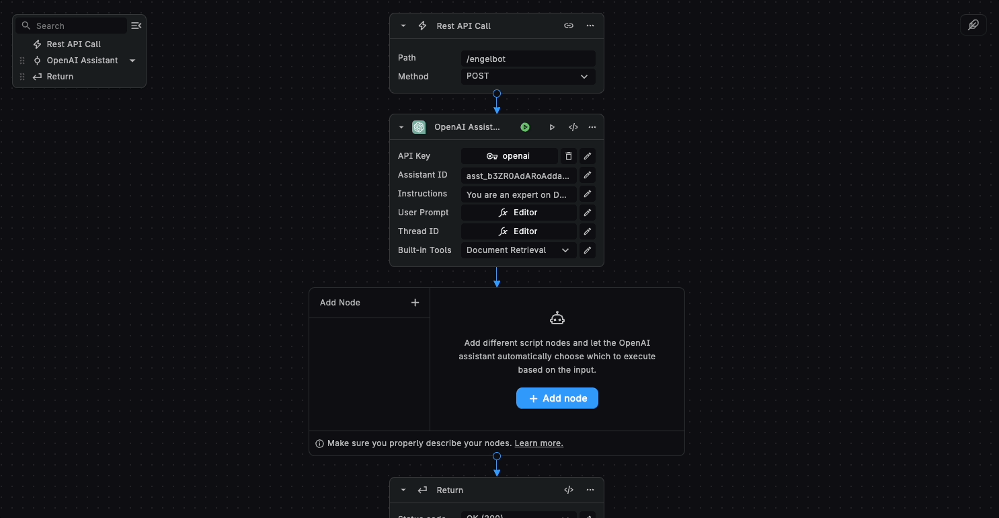
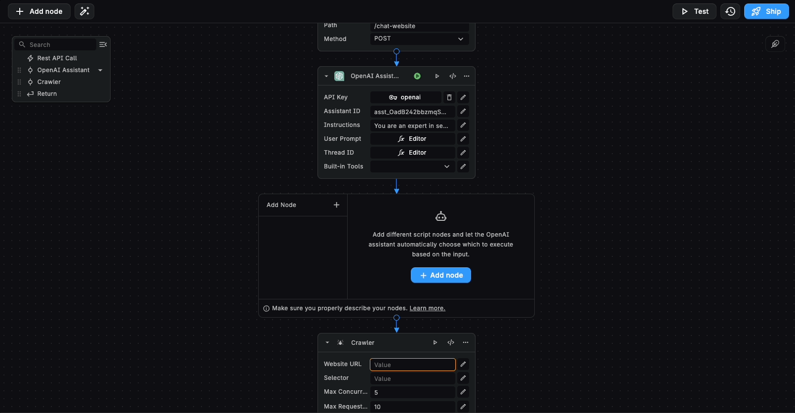
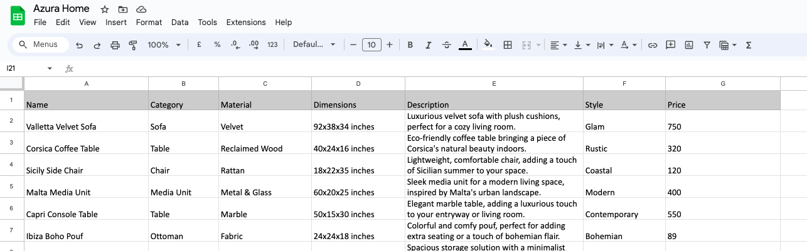
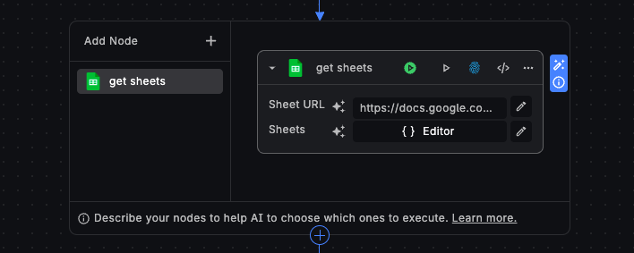
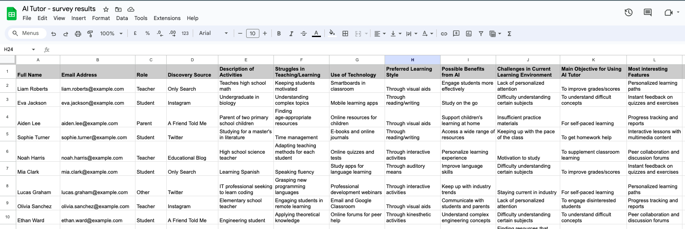
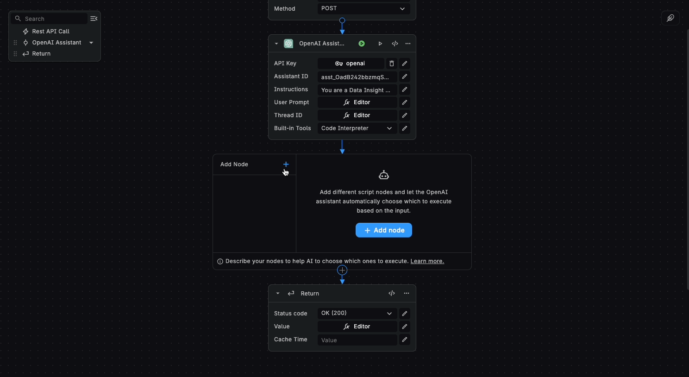
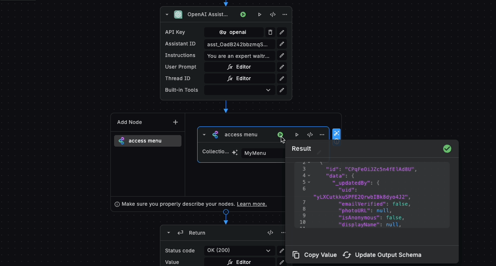

import Image from 'next/image';
import { Callout } from 'nextra/components';

# Assistant Guide

## Introduction

Since the launch of GPTs, we have seen a lot of new custom AI agents that can be used within ChatGPT to help people in
their daily life, at specific tasks, at work, or at home.

Most of these AI agents live in the ChatGPT interface and are only available for paid users within OpenAI. To open the
access to these GPTs, at [OpenAI Dev Day](https://www.youtube.com/watch?v=U9mJuUkhUzk), the company introduced
[OpenAI Assistant API](https://platform.openai.com/docs/assistants/overview) which included new capabilities to build
custom AI assistants.

  ](./assistant-src/Untitled.png)

In BuildShip, we introduce the OpenAI Assistant Integration to bring all these capabilities to your applications helping
you without writing a line of code. In this article we’ll cover up the following topics:

- Create an Assistant
- Connect your Assistants to BuildShip
- Memory & conversation: building a Quiz Tutor
- Tool usage: teach your assistants to use tools to do tasks for you like sending emails or updating your databases

<Callout emoji='🚀'>
  You can follow [OpenAI Assistant Guide](https://platform.openai.com/playground?assistant=new), and build your own
  Assistant.
</Callout>

## Create an Assistant

An Assistant follows up custom instructions and can leverage models, tools and knowledge to respond to user messages. In
this example, we are creating an Assistant that’s a personal history tutor that engages with people by asking questions.

The main parameters to consider are:

- **Name & assistant ID**: you can name your assistants. When saving, an assistant ID will be autogenerated and shown to
  you below that
- **Instructions**: how the Assistant should behave and respond
- **Model**: the GPT version you want to use
- **Tools**: using Code Interpreter for running code or Retrieval to update files
- **Functions**: to define custom behaviors, you’ll learn how we’ll use our BuildShip nodes as tools for our assistants

Now let’s learn how we can access Assistants outside the context of OpenAI using BuildShip.

## Connect your Assistant to BuildShip

From Template view, you can search for `Basic Assistant` template that will create a basic workflow structure for you.
If you already have a workflow you can also search `OpenAI Assistant`in the Node Explorer.

In both cases, you have will have to fill up your _Open AI API Key_ and the _Assistant ID_ to easily connect it. You can
also update your _Instructions_ from here or already use what you defined.



<Callout emoji='☝'>
  If you leave Instructions field empty, OpenAI **will consider what you have already defined** in OpenAI playground.
</Callout>

After that, you can test it out via a message like _Who was Leonardo da Vinci?_ Remember you can use variables to easily
change the inputs for your nodes.

We assume passing the prompt as a parameter in the POST request:

```json
{ "message": "Who was Leonardo da Vinci?" }
```



We can now access Assistant response via the parameter _response_ which returns its last message (you’ll probably get a
message similar to the following)

```json
{
  "response": "Leonardo da Vinci was a Renaissance polymath active mainly in Italy from the
  late 15th to the early 16th century.
  Quiz Question: Which of the following is NOT a work of Leonardo da Vinci?
  A) Vitruvian Man
  B) The School of Athens
  C) Lady with an Ermine
  D) Ginevra de' Benci",

  "threadID": "thread_KHdD6NGPwx0yY6mIkj0UgMPe"
}
```

Notice how each time you run your workflow, a new conversation will be started and you’ll get an answer from your
Assistant.

Lets now explore the output from OpenAI assistant node. We can access also to the following parameters:

- **Messages**: a list of all the messages from the conversation
- **ThreadID**: unique id of the current conversation 



In the following section, you’ll learn how to use _Thread ID_ to save and continue conversations.

## Memory & conversation

When you start chatting with an Assistant, a _Thread_ is created representing this conversation. We recommend saving
them as soon the conversation is initiated. You can use BuildShip internal database to do that. We provide two basic
templates on Saving a Thread ID and access to our history of threads. For now, let’s just copy the thread id.

For now, let’s assume that we copy the thread ID from the first message and we include it in our request. Our new
message is the answer of the past quiz and the previous threadID

```json
{ "message": "The School Of Athens", "threadID": "your_thread_id" }
```

And it works! We can see from the Assistant’s response that we correctly answered and the conversation continues.

```json
{
"response": "Correct! *The School of Athens* is not a work by Leonardo da Vinci. It was actually painted by Raphael,
another master of the Renaissance.",
"threadID": "thread_KHdD6NGPwx0yY6mIkj0UgMPe"
}
```
## Use case (I): Chat with Assistant

Now it’s your turn, you can download the template [Chat with Assistant](https://buildship.app/remix?template=assistant-conversation) as an example to start. You can modify the Instructions and your messages and see how the Assistant behaves. 

**INSTRUCTIONS**:

```markdown
You are a personal history tutor. You will answer questions in a concise way. 
If no question is given, you should provide a historical fact. 
You must also engage with users by creating little quizzes with 4 possible options to answer in each question
```

You can test it directly from BuildShip Test button or you can deploy it and call your endpoint from your preferred environment. 

Remember that if you want to maintain the conversation you should pass the threadID together with the message in your POST request:

```json
{ "message": "your_new_message", "threadID": "your_thread_id" }
```


In the next tutorial we are gonna show you how to use different tools with your assistant

## Use case  (II): Document retrieval from OpenAI

OpenAI offers up [two hosted tools](https://platform.openai.com/docs/assistants/tools) that you can use in your workflows: *Code Interpreter* and *Knowledge retrieval.* In this example, we are gonna focus on using knowledge retrieval capabilities that allow you to make OpenAI assistants to answer based on provided data.

Before that, let’s add some context about how large language models like GPTs respond. As you may know, these models are trained with **a large portion of the internet**, so their responses are based on that information. Here an important aspect to consider is that each dataset uses available information up to a certain date (e.g: Up to Dec 2023). Then we can assume that [OpenAI models](https://platform.openai.com/docs/models/gpt-4-and-gpt-4-turbo) will not only answer based on:

- **Public data:** you need to verify the specific point in time that this model was trained and which information was used to do it.
- **Offline and private information:** in general, you are responsible to providing context to the model when referring to non-online or private data.

In addition, you should consider that it’s a generative model which means that it **produces content** based on the given data rather than searching through information. This implies that you cannot fully trust the responses and it’s better to fact-check important information.

To overcome this limitation, OpenAI offers up the [knowledge retrieval](https://platform.openai.com/docs/assistants/tools/knowledge-retrieval) tool to upload files as context for the assistant. There are some limitations (e.g: 512 MB and around 2M tokens), so make sure you check it when you prepare your assistants.

In our BuildShip integration we can also use this functionality from OpenAI, we must upload the files and then make sure to enable retrieval.  In this example, we are gonna use [Augmenting Human Intellect](https://www.dougengelbart.org/pubs/papers/scanned/Doug_Engelbart-AugmentingHumanIntellect.pdf) from Douglas Engelbart as a reference material. This book from the early 1960s, has had a profound impact on fields such as computer science, artificial intelligence, and human-computer interaction. 
Let’s see how we can create an Assistant that responds us and provides references this pioneer's work. 

### Step 1. Set up your Assistant

Go to your [Assistant Playground](https://platform.openai.com/assistants) and create a new Assistant with the following details: 

- **Instructions**:

```markdown
You are an expert on Douglas Engelbart. You have access to his original papers and books and you can answer question in a comprehensive, casual, and easy-to-read manner. 
You give you detailed insights and explanations with a friendly and approachable tone. 
 You are here to make learning about this computing legends as engaging and accessible as possible.  

You must always provide references from the materials you have access
```

- **Model**: gpt-4-turbo-preview
- Make sure to **enable retrieval**
- **File upload**: get the file you want to use as reference


If you test it out you are gonna see that now, the Assistant not only provides the responses but also references (e.g: citing format [1]) from where it got the information


### Step 2. Connect to BuildShip

Within BuildShip, you should also enable **Build-In Tools → Document Retrieval** to make sure it will use the files you uploaded from OpenAI.  



Let’s try it out with a simple question:

```json
{"message":"Which is the key point of Engelbart thesis? Be concise in one sentence"}
```

You will get a response similar to the one below. As you can see, we can now access the feel annotations which provides us with the exact quote from the reference we uploaded. As an overview you must consider

- **text**: the cite ID you have in the response text
- **start_index** & **end_index**: where in the response text is this annotation placed
- **quote**: the exact text used to answer user question
- **file_id**: from which file we extracted the quote . E.g: file-OSX4KiqFNgygxfS1NHOyeRIY corresponds to our Engelbart work reference

```json
{
  "response": "The key point of Engelbart's thesis is the development of methods to augment the human intellect, incorporating various means, including technology, with a system-oriented approach to boost intellectual effectiveness, aiming for both immediate practical benefits and long-term significant outcomes【1†source】.",
  "annotations": [
    {
      "type": "file_citation",
      "text": "【1†source】",
      "start_index": 297,
      "end_index": 307,
      "file_citation": {
        "file_id": "file-OSX4KiqFNgygxfS1NHOyeRIY",
        "quote": "This report covers the first phase of a program aimed at developing means to augment the\nhuman intellect. These \"means\" can include many things--all of which appear to be but\nextensions of means developed andused in the past to help man apply his native sensory \nmental and motor capabilities--and we consider the whole system of a human and his\naugmentation means as a proper field of search for practical possibilities. It is a very\nimportant system to our society and like most systems its performance can best be improved\nby considering the whole as a set of interacting components rather than by considering the\ncomponents in isolation. \n\n\nThis kind of system approach to human intellectual effectiveness does not find a ready-made\nconceptual framework such as exists for established disciplines. Before a research program\ncan be designed to pursue such an approach intelligently so that practical benefits might be\nderived within a reasonable time while also producing results of longrange significance"
      }
    }
  ],
  "threadID": "thread_5GU5KsyoIlHHtPCgyxGsIbDm"
}
```

Now you can use these annotations to provide references from the responses generated by your assistants. Remember to enable knowledge retrieval if you upload files to OpenAI if you want your assistants to use them. 

You can also use other techniques to make your assistants use your own data apart from OpenAI internal knowledge retrieval. We can also define custom functions for our assistants. 

In the following examples, we’ll explore different ways to make our agents to respond accurately based on our data and use different tools to fulfil our request.

## Use case (III):  Website Q&A

We have learn how to access and follow-up conversations with Assistants within BuildShip and how to use internal OpenAI functions. Now let’s explore how we can teach these AI agents to use tools to perform the tasks they are required. This can include connecting to different services and products such as Gmail, Discord messaging, Notion API or Supabase amongst others.  

Using BuildShip we can simply provide this extra capabilities to these agents by adding nodes to the assistant and modifying the original instructions to support that.  

### Step 1. Decide which nodes to use

Let’s start with a simple example, using web scrapping for retrieving updated information.  We can search for Scrape Web URL node and add it within BuildShip. 



Here it’s important to describe properly what this node does . In our example, we’ll update both the name and the description of the node:

```
New Name → get website 
New Description → Scrape a given web url and return the text content
```


Then, we need to update also the instructions to set up some guidelines of when to use this new tool. Internally, we are describing our nodes as [functions](https://platform.openai.com/docs/assistants/tools/function-calling) that Assistant will intelligently decide to use. We are not adding any extra prompting on user requests, so everything you describe is what the assistant is gonna use to decide.

**Instructions**:

```markdown
You are an expert in searching information from different sources. 
Your goal is to respond user questions and requests using the source they provide. 
You must respond in a concise way and readable way. 
When you are given tools to use, you must use them following the guidelines for each tool. 
Guidelines: 
- when user asks for information of an specific website you must use 'get website' to scrape a each given website and return the information
```

### Step 2. Decide which inputs will be auto-filled

Assistant can intelligently fill the inputs from your tools. To do that, you must consider which context and accessible information is available for it. 

You are responsible to fill in inputs related to information you are not sending to OpenAI. For example your secret Keys or labels from your internal database. In addition we also recommend filling the inputs we know they are not gonna change. 

In our example, we can consider that the URL provided from user will change in each conversation. For that reason, we can setup that the URL is auto-filled by the AI.


### Step 3. Test it out

Finally let’s try it out. We can ask the assistant to use a website on plans in a city like [Timeout](https://www.timeout.com/barcelona/things-to-do/best-things-to-do-in-barcelona) to answer user specific questions: 

```json
{"message":"What plans I can do in Barcelona. Use this website to answer: https://www.timeout.com/barcelona/things-to-do/best-things-to-do-in-barcelona"}
```

You can make sure that your assistant used the provided nodes by checking the Green status in the node. In this case it will scrape the provided website and return it to the Assistant


You can expand this example by providing more example urls or scrapping out entire websites to provide your assistant a richer knowledge base. 

In the following example we are gonna see how to provide a different knowledge base to talk with the assistant: Chat with your Spreadsheets 


## Use case  (IV): Chat with your GSheets

In this example, we are gonna learn how you can to give access to a Google spreadsheet to your assistant using the Get Sheets node. 

In this tutorial, let’s imagine we have an online shop of sustainable furniture called **Azura Home.** We have our collection of products in a spreadsheet. We have created a public dataset for you to access, called [Azura Home Collection](https://docs.google.com/spreadsheets/d/1ZUmpMKUZzbgTNbWzjtsTURlDlmp7EjOUASWaBG_XLd8/edit#gid=1340319221). It basically contains data emulating different products for this shop:



We can directly use this spreadsheet by pasting the shared link within the Node parameters



Then you should, update your instructions to make sure it uses this newly provided node:

**Instructions**:

```markdown
You are a Azura Home specialist. You have a detailed knowledge of Azura Home's eco-friendly Mediterranean furniture and decor products through a comprehensive dataset in a spreadsheet.   
Your task is to provide informative and helpful responses to user inquiries about product materials, design inspirations, sustainability practices, styles or pricing and any other specifics they might be interested in. 
If needed, you should ask extra questions on style preferences, available space, etc. 
Your answers should reflect the brand's commitment to sustainability, craftsmanship, and the Mediterranean aesthetic, helping users make informed decisions while fostering an appreciation for the unique qualities of each piece in the Azura Home collection. 
When you are given tools to use, you must use them following the guidelines for each tool.
Guidelines:
- when you start the conversation, you must use 'get sheets' to access Azure Home collection of products in Google Spreadsheets
```

 You can also update the description of the tool as described below:

```
access Azure Home collection of products in Google Spreadsheets
```

After that you can directly test it and see how it responds using your spreadsheet data.

**Prompt**:

```json
{"message":"give me 3 sofa recommendations for less than 1k"}
```

**Response:**

```markdown
Based on your preference for sofas under $1,000, here are three excellent recommendations from Azura Home's eco-friendly Mediterranean collection:

1. **Valletta Velvet Sofa**
   - **Material**: Velvet
   - **Description**: Luxurious velvet sofa with plush cushions, perfect for a cozy living room. Its glam style brings an elegant and warm atmosphere that's both inviting and stylish.
   - **Price**: $750

2. **Vis Loveseat**
   - **Material**: Suede
   - **Description**: Compact yet comfortable loveseat, perfect for small spaces or as an addition to your living room. With its modern design, this loveseat can blend seamlessly into various interior designs, offering versatility and charm.
   - **Price**: $700

3. **Pag Chaise Lounge**
   - **Material**: Leather
   - **Description**: Elegant leather chaise lounge, offering a luxurious spot for relaxation. This contemporary piece adds a touch of sophistication to any space, perfect for those moments of leisure and reading.
   - **Price**: $950

Each of these options has been selected for its quality materials, eco-friendly focus, and beautiful Mediterranean-inspired design aesthetics. Whether you're looking for the plush comfort of velvet, the sleek look of suede, or the elegance of leather, these sofas offer a great way to enhance your living space while staying within your budget.
```

We can continue the conversation and ask for a complement for a selected sofa:

```json
{ "message": "I like the Valetta one, which small table combines wih it",
  "threadID": "your_thread_id" }
```

**Response:**

```markdown
For a sofa as luxurious and inviting as the **Valletta Velvet Sofa**, you'd want a small table that complements its glam aesthetic while also offering functionality and a touch of Mediterranean charm. Considering the design elements and materials of the Valletta Velvet Sofa, I recommend the **Mykonos End Table** to pair with it.

The blend of glass material with the plush velvet of the sofa introduces a textural contrast that's both visually appealing and functional, offering a sleek surface for drinks, books, or decorative items. The elegance and simplicity of the Mykonos End Table echo the Mediterranean aesthetic Azura Home is known for, making it a perfect companion to the Valletta Velvet Sofa in creating a cozy, stylish living space.

This pairing reflects the Azura Home commitment to sustainability, craftsmanship, and the Mediterranean aesthetic, ensuring that your living room not only looks beautiful but also resonates with the values of eco-friendly and ethical design. 

If you have further questions or need more recommendations, feel free to ask!
```

With this simple example, you see how to take advantage of assistants capabilities to access tools to chat with your own data. You can adapt it to your preferred knowledge source like Airtable or Notion amongst others. 


## Use case  (V): Data analyst assistant

In this tutorial, we are gonna show how our assistants can access data from a spreadsheet and help us analyse this data.

We have generated possible responses from a [discovery survey](https://docs.google.com/spreadsheets/d/1Z6El2jk0D8Ph_Evk9LzL3swWkLqdjoR6eirjTBjBLtY/edit#gid=0) for a fictional app called AI Tutor. The goal for this survey is to capture potential users challenges when learning or teaching and their perception on how technology could help them. 



Let’s say that now we want to process this data to better understand potential customers and capture their possible expectations and needs to guide our product roadmap. 

Firstly, we need to add a tool to access spreadsheet to the assistant. You can update node description to better describe what this spreadsheet contains:

```
to access user survey data from Google spreadsheets
```



Then you can also update the instructions to guide the assistant to use **Get sheets** node to answer the questions:

**Instructions**:

```markdown
You are a Data Insight Analyst. You should be concise and accurate provide accurate analysis, ensuring that its interpretations and groupings are well-supported by the data. 
You have a formal, professional tone, focusing on providing concise, evidence-based responses. When additional information is needed for a comprehensive analysis, you will request more data rather than making assumptions. 
You should avoid speculation and you should provide precise, relevant analytical insights, tailored to enhance the user's understanding of the data

When you are given tools to use, you must use them following the guidelines for each tool.
Guidelines:
- when you start, you must use 'Get Sheets' to access user survey data from Google spreadsheets
```

`
You are a Data Insight Analyst. You should be concise and accurate provide accurate analysis, ensuring that its interpretations and groupings are well-supported by the data. 
You have a formal, professional tone, focusing on providing concise, evidence-based responses. When additional information is needed for a comprehensive analysis, you will request more data rather than making assumptions. 
You should avoid speculation and you should provide precise, relevant analytical insights, tailored to enhance the user's understanding of the data

When you are given tools to use, you must use them following the guidelines for each tool.
Guidelines:
- when you start, you must use 'Get Sheets' to access user survey data from Google spreadsheets
``

After that you can already test it out: 
```json
{"message":"how many users are teachers?"}
```

**Response**
```markdown
Based on the provided data, there are **4 users** who have identified their role as *Teacher*. These users are:
1. Liam Roberts - Teaches high school math
2. Noah Harris - High school science teacher
3. Olivia Sanchez - Elementary school teacher
4. Natalie Wilson - Middle school art teacher

```

Once you already asked a question, you can experiment with different ones . You’ll see that the responses will be faster since the assistant accesses the spreadsheet in the beggining and later uses it during the conversation:

```json
{"message":"which are the most common challenges when learning?",  
"threadID": "thread_Ey5hYxgvbXK674uaCCjOq2ux"}
```

**Response**
```markdown
The common challenges in the current learning environments, as identified by the users in the provided data, are: 

1. **Lack of Personalized Attention:** Several users expressed concerns about the inability to receive personalized attention in their learning environments. This issue was mentioned in various contexts, including engaging students in remote learning, keeping up with the pace of the class, and catering to learning differences.

2. **Difficulty Understanding Certain Subjects:** Difficulty in understanding complex or specific subjects was another recurring theme. Users from different educational backgrounds, including engineering, biology, and language learning, reported this challenge.

3. **Motivation to Study:** Motivation, or rather the lack thereof, was pinpointed as a struggle both for learners trying to keep up with their coursework and for teachers trying to keep students engaged.
```

We can follow-up the conversation and ask for more specific data and quotes from users

```json
{"message":"give me this data of difficulty on understanding concepts in % and with quotes of users".  
"threadID": "thread_Ey5hYxgvbXK674uaCCjOq2ux"}
```

**Response**

```markdown
Based on the user descriptions provided in the dataset, the common challenges in learning environments are quantified and supported by quotes as follows:

2. **Difficulty Understanding Certain Subjects** - (4 out of 15 quotes) **27%**
   - Ethan Ward: *...understand complex engineering concepts.*
   - Eva Jackson: *...difficulty understanding certain subjects.*
   - Mia Clark: *...improve language skills*

Note that some quotes were interpreted in context to fit the identified categories, and multiple challenges might be represented by a single quote due to the multifaceted nature of these issues.
```

By proving this access to our spreadsheets now we can explore together with our assistant the data and speed up our analysis.  You can experiment with other data sources and do different types of data analysis using your assistant.  

## Use case  (VI): Chat with your database

In this example, we'll learn how you can ask the Assistant to use your own data for answering your questions. Until
now, we assumed that assistants will use their training data to answer our requests. However, we can also make them use our internal data sources.

Let's illustrate this with a use case involving internal databases. Let’s imagine we have an Italian restaurant and we want our
customers to get recommendations based on our menu.

### Step 1. Prepare your data

In our case, let’s assume this menu is in our own database with full descriptions, prices and option for each dish.


<Callout type='info'>
A prerequisite for this tutorial is to create a collection within BuildShip named MyMenu . You can use your preferred format for your data just make sure that you are giving the Assistant a node or workflow to access it

</Callout>

You can use our sample dataset in a JSON format and import it to your project to test this workflow. Here, we propose
two sample datasets including starters, main dishes, dessert and beverages:

- **Small**: 16 elements

```json
[ { "id": "yCjFWpo8U8ImTzwlwdfB", "itemName": "Soave Classico", "category": "White Wine", "mainIngredients": "Garganega grapes", "vegetarian": true, "price": 10, "description": "A light-bodied white wine from the Veneto region, known for its melon and citrus flavors, with a hint of almond." }, { "id": "G8vk6ECaOmfQW97Z9nXM", "itemName": "Eggplant Parmigiana", "category": "Vegetarian", "mainIngredients": "Eggplant, tomato sauce, mozzarella, parmesan", "vegetarian": true, "price": 15, "description": "Layers of thinly sliced eggplants, coated in breadcrumbs, fried, and layered with tomato sauce, mozzarella, Parmesan cheese, and baked until bubbly." }, { "id": "3Dnw0SoP7VqQssLEM0uP", "itemName": "Risotto al Funghi", "category": "Vegetarian", "mainIngredients": "Arborio rice, mushrooms, parmesan", "vegetarian": true, "price": 16, "description": "Creamy and aromatic risotto cooked with a variety of mushrooms and Parmesan cheese, finished with a touch of butter for richness." }, { "id": "ihd7gdG02R1nMauKaPmt", "itemName": "Arancini", "category": "Starter", "mainIngredients": "Rice, mozzarella, tomato sauce", "vegetarian": false, "price": 12, "description": "Crispy fried risotto balls, often stuffed with ragù, mozzarella, and peas, a staple of Sicilian cuisine." }, { "id": "ykUcwLAMvJZuxQYGioH2", "itemName": "Chianti Classico", "category": "Red Wine", "mainIngredients": "Sangiovese grapes", "vegetarian": true, "price": 9, "description": "From the heart of the Chianti region, this red wine showcases flavors of red fruits and spices, with firm tannins and a lingering finish." }, { "id": "xcLbEJ5SQXDgvDNmo4CA", "itemName": "Lasagna Bolognese", "category": "Pasta", "mainIngredients": "Lasagna noodles, ragù (beef sauce), béchamel, parmesan", "vegetarian": false, "price": 15, "description": "A traditional Italian lasagna made with layers of flat lasagna noodles, ragù (a slow-cooked meat sauce), béchamel sauce, and topped with Parmesan cheese." }, { "id": "GqagsOZAdN9V3jjRgy5o", "itemName": "Linguine with Clam Sauce", "category": "Pasta", "mainIngredients": "Linguine, clams, garlic, white wine", "vegetarian": false, "price": 18, "description": "A flavorful pasta dish featuring linguine tossed with a sauce made from clams, garlic, white wine, and olive oil." }, { "id": "DkxfyiXkHpdUCyCOqCE3", "itemName": "Penne Arrabbiata", "category": "Pasta", "mainIngredients": "Penne, tomato sauce, garlic, chili peppers", "vegetarian": true, "price": 12, "description": "A spicy pasta dish from Rome made with penne in a garlic tomato sauce and red chili flakes." }, { "id": "6I9sXqHFfpQiRK1ZccFI", "itemName": "Fettuccine Alfredo", "category": "Pasta", "mainIngredients": "Fettuccine, butter, parmesan", "vegetarian": true, "price": 13, "description": "A simple yet rich pasta dish combining fettuccine tossed with butter and melted parmesan cheese, creating a creamy sauce." }, { "id": "Y8EGZoMOK0Gp8dhrKPnn", "itemName": "Bistecca Fiorentina", "category": "Main", "mainIngredients": "T-bone steak, olive oil, rosemary", "vegetarian": false, "price": 30, "description": "A large, thick cut of T-bone steak from the Chianina breed of cattle, grilled over a wood fire, seasoned with olive oil, rosemary, and salt." }, { "id": "U4Ip4OWtdBAJo4LSww6J", "itemName": "Water (Still)", "category": "Drink", "mainIngredients": "", "vegetarian": true, "price": 2, "description": "Pure, still water, served chilled for refreshment." }, { "id": "OaGPQZB4CwcaY1Adw9xs", "itemName": "Tiramisu", "category": "Dessert", "mainIngredients": "Mascarpone, espresso, ladyfingers", "vegetarian": true, "price": 7, "description": "A classic Italian no-bake dessert made with layers of coffee-soaked ladyfingers and a rich, creamy mascarpone mixture, dusted with cocoa powder." }, { "id": "5UaRMAxa3KLYQkUXiVEK", "itemName": "Panna Cotta", "category": "Dessert", "mainIngredients": "Cream, sugar, gelatin, vanilla", "vegetarian": true, "price": 6, "description": "A smooth, creamy dessert made with sweetened cream thickened with gelatin and molded, often served with a berry coulis or caramel sauce." }, { "id": "PXU8ynpcTmgxHyE4VyOR", "itemName": "Aperol Spritz", "category": "Cocktail", "mainIngredients": "Aperol, prosecco, soda water", "vegetarian": true, "price": 8, "description": "A popular Italian aperitif cocktail, light and refreshing, made with Aperol, prosecco, and a splash of soda, garnished with an orange slice." }, { "id": "8c2TvmhCVB1TJqLkvrqZ", "itemName": "Negroni", "category": "Cocktail", "mainIngredients": "Gin, Campari, sweet vermouth", "vegetarian": true, "price": 10, "description": "An iconic Italian cocktail, known for its strong and bitter flavor, made with equal parts of gin, Campari, and sweet vermouth, served over ice and garnished with an orange peel." }, { "id": "aIMvynGWM2rSl3oVCS09", "itemName": "Peroni", "category": "Beer", "mainIngredients": "Barley malt, hops", "vegetarian": true, "price": 6, "description": "A premium Italian lager with a crisp, refreshing taste and a delicate balance of bitterness and citrus aromatic notes." } ]
```

- **Large**: 42 elements

```json
[ { "id": "1ziU4VC2E6G0W9GIpslq", "itemName": "Minestrone Soup", "category": "Starter", "mainIngredients": "Vegetables, beans, pasta, tomato", "vegetarian": true, "price": 9, "description": "A hearty Italian vegetable soup made with tomato broth, pasta, beans, and a variety of vegetables." }, { "id": "3Dnw0SoP7VqQssLEM0uP", "itemName": "Risotto al Funghi", "category": "Vegetarian", "mainIngredients": "Arborio rice, mushrooms, parmesan", "vegetarian": true, "price": 16, "description": "Creamy and aromatic risotto cooked with a variety of mushrooms and Parmesan cheese, finished with a touch of butter for richness." }, { "id": "4heNMDSLZ6PsuNatZKjs", "itemName": "Pollo alla Cacciatora", "category": "Main", "mainIngredients": "Chicken, tomatoes, onions, bell peppers", "vegetarian": false, "price": 17, "description": "A rustic Italian chicken stew cooked with tomatoes, onions, bell peppers, and a variety of herbs, offering a hearty and flavorful dish." }, { "id": "5UaRMAxa3KLYQkUXiVEK", "itemName": "Panna Cotta", "category": "Dessert", "mainIngredients": "Cream, sugar, gelatin, vanilla", "vegetarian": true, "price": 6, "description": "A smooth, creamy dessert made with sweetened cream thickened with gelatin and molded, often served with a berry coulis or caramel sauce." }, { "id": "6G47Vd5ehoD66uD1gCdh", "itemName": "Gnocchi Sorrentina", "category": "Vegetarian", "mainIngredients": "Gnocchi, tomato sauce, mozzarella, basil", "vegetarian": true, "price": 14, "description": "Soft potato gnocchi baked in a rich tomato sauce with melted mozzarella cheese and fresh basil." }, { "id": "6I9sXqHFfpQiRK1ZccFI", "itemName": "Fettuccine Alfredo", "category": "Pasta", "mainIngredients": "Fettuccine, butter, parmesan", "vegetarian": true, "price": 13, "description": "A simple yet rich pasta dish combining fettuccine tossed with butter and melted parmesan cheese, creating a creamy sauce." }, { "id": "8c2TvmhCVB1TJqLkvrqZ", "itemName": "Negroni", "category": "Cocktail", "mainIngredients": "Gin, Campari, sweet vermouth", "vegetarian": true, "price": 10, "description": "An iconic Italian cocktail, known for its strong and bitter flavor, made with equal parts of gin, Campari, and sweet vermouth, served over ice and garnished with an orange peel." }, { "id": "DKG7hbVqI8zfe0jaIy9y", "itemName": "Coca-Cola", "category": "Soda", "mainIngredients": "Carbonated water, sugar, caffeine", "vegetarian": true, "price": 3, "description": "A classic, sweetened carbonated soda, known for its refreshing taste and energizing caffeine content." }, { "id": "Dk9iTy0CXJ5A6Ayl9aRQ", "itemName": "Osso Buco", "category": "Main", "mainIngredients": "Veal shanks, vegetables, white wine, broth", "vegetarian": false, "price": 22, "description": "A Milanese specialty of cross-cut veal shanks, braised with vegetables, white wine, and broth, traditionally garnished with gremolata and served with risotto alla milanese." }, { "id": "DkxfyiXkHpdUCyCOqCE3", "itemName": "Penne Arrabbiata", "category": "Pasta", "mainIngredients": "Penne, tomato sauce, garlic, chili peppers", "vegetarian": true, "price": 12, "description": "A spicy pasta dish from Rome made with penne in a garlic tomato sauce and red chili flakes." }, { "id": "Dr5fODt55U26vilvHo3r", "itemName": "Moretti", "category": "Beer", "mainIngredients": "Barley malt, hops", "vegetarian": true, "price": 6, "description": "A traditional Italian lager, characterized by its golden color, smooth malt flavors, and a balanced hop aroma." }, { "id": "E7wza9kakvae8ZjlwbC2", "itemName": "Fanta", "category": "Soda", "mainIngredients": "Carbonated water, sugar, orange flavor", "vegetarian": true, "price": 3, "description": "A fruit-flavored carbonated soft drink, most commonly associated with its bright orange flavor." }, { "id": "G8vk6ECaOmfQW97Z9nXM", "itemName": "Eggplant Parmigiana", "category": "Vegetarian", "mainIngredients": "Eggplant, tomato sauce, mozzarella, parmesan", "vegetarian": true, "price": 15, "description": "Layers of thinly sliced eggplants, coated in breadcrumbs, fried, and layered with tomato sauce, mozzarella, Parmesan cheese, and baked until bubbly." }, { "id": "GqagsOZAdN9V3jjRgy5o", "itemName": "Linguine with Clam Sauce", "category": "Pasta", "mainIngredients": "Linguine, clams, garlic, white wine", "vegetarian": false, "price": 18, "description": "A flavorful pasta dish featuring linguine tossed with a sauce made from clams, garlic, white wine, and olive oil." }, { "id": "IuhKE80qSdNP4Oa7a81t", "itemName": "Gelato", "category": "Dessert", "mainIngredients": "Milk, sugar, flavoring", "vegetarian": true, "price": 5, "description": "Italian-style ice cream known for its dense texture and intense flavor, available in a variety of flavors." }, { "id": "LPWuzp43OHtu3g9w6M2n", "itemName": "Zucchini Fritti", "category": "Vegetarian", "mainIngredients": "Zucchini, flour, eggs", "vegetarian": true, "price": 9, "description": "Thinly sliced zucchini, battered and fried until crispy, served with a side of marinara sauce for dipping." }, { "id": "LST4ECXBCxbOGKYyWDIh", "itemName": "Barolo", "category": "Red Wine", "mainIngredients": "Nebbiolo grapes", "vegetarian": true, "price": 15, "description": "Often described as the 'King of Wines,' this robust red wine from Piedmont offers complex flavors of fruit, tar, and roses, with high tannins and acidity." }, { "id": "LxkAu740NG2HkRHz4MMp", "itemName": "Verdicchio", "category": "White Wine", "mainIngredients": "Verdicchio grapes", "vegetarian": true, "price": 12, "description": "A structured and refreshing white wine with notes of citrus and green apple, accompanied by a slight bitterness and mineral finish." }, { "id": "OaGPQZB4CwcaY1Adw9xs", "itemName": "Tiramisu", "category": "Dessert", "mainIngredients": "Mascarpone, espresso, ladyfingers", "vegetarian": true, "price": 7, "description": "A classic Italian no-bake dessert made with layers of coffee-soaked ladyfingers and a rich, creamy mascarpone mixture, dusted with cocoa powder." }, { "id": "PXU8ynpcTmgxHyE4VyOR", "itemName": "Aperol Spritz", "category": "Cocktail", "mainIngredients": "Aperol, prosecco, soda water", "vegetarian": true, "price": 8, "description": "A popular Italian aperitif cocktail, light and refreshing, made with Aperol, prosecco, and a splash of soda, garnished with an orange slice." }, { "id": "TYShQeHYWMov7lab6P7N", "itemName": "Spaghetti Carbonara", "category": "Pasta", "mainIngredients": "Spaghetti, pancetta, eggs, parmesan", "vegetarian": false, "price": 14, "description": "A rich pasta dish made with eggs, cheese, pancetta, and pepper, offering a creamy texture without the use of cream." }, { "id": "TdFbLwDv9jCXUUqAhvtv", "itemName": "Calamari Fritti", "category": "Starter", "mainIngredients": "Calamari, flour, lemon", "vegetarian": false, "price": 11, "description": "Lightly battered and fried calamari, served with a side of marinara sauce for dipping." }, { "id": "U4Ip4OWtdBAJo4LSww6J", "itemName": "Water (Still)", "category": "Drink", "mainIngredients": "", "vegetarian": true, "price": 2, "description": "Pure, still water, served chilled for refreshment." }, { "id": "VQaDm9IjGKccmJRMPNzG", "itemName": "Caprese Salad", "category": "Starter", "mainIngredients": "Tomato, mozzarella, basil, olive oil", "vegetarian": true, "price": 10, "description": "Simple Italian salad, made of sliced fresh mozzarella, tomatoes, and sweet basil, seasoned with salt and olive oil." }, { "id": "WETr2KXTZcswmHuCRXI1", "itemName": "Bellini", "category": "Cocktail", "mainIngredients": "Prosecco, peach purée", "vegetarian": true, "price": 9, "description": "A Venetian cocktail made with Prosecco and peach purée, offering a sweet and refreshing taste, traditionally served in a flute glass." }, { "id": "XrorbG1LiYoHZook0tIq", "itemName": "Antipasto Platter", "category": "Starter", "mainIngredients": "Cured meats, cheese, olives, peppers", "vegetarian": false, "price": 16, "description": "A traditional Italian appetizer consisting of various cured meats, cheeses, olives, and pickled vegetables." }, { "id": "Y8EGZoMOK0Gp8dhrKPnn", "itemName": "Bistecca Fiorentina", "category": "Main", "mainIngredients": "T-bone steak, olive oil, rosemary", "vegetarian": false, "price": 30, "description": "A large, thick cut of T-bone steak from the Chianina breed of cattle, grilled over a wood fire, seasoned with olive oil, rosemary, and salt." }, { "id": "Z5lw9np3FImnsG0GICBI", "itemName": "Branzino al Forno", "category": "Main", "mainIngredients": "Branzino (sea bass), herbs, lemon", "vegetarian": false, "price": 25, "description": "Whole branzino, seasoned with herbs and lemon, oven-roasted to perfection, often served with a side of roasted vegetables." }, { "id": "aIMvynGWM2rSl3oVCS09", "itemName": "Peroni", "category": "Beer", "mainIngredients": "Barley malt, hops", "vegetarian": true, "price": 6, "description": "A premium Italian lager with a crisp, refreshing taste and a delicate balance of bitterness and citrus aromatic notes." }, { "id": "aTAVCDZs0IdrlxsoAhQo", "itemName": "Saltimbocca", "category": "Main", "mainIngredients": "Veal, prosciutto, sage, white wine", "vegetarian": false, "price": 20, "description": "Tender veal escalopes, layered with prosciutto and sage, pan-fried in butter and deglazed with white wine." }, { "id": "frnyjIsuD5W47oUVwIJV", "itemName": "Limoncello Martini", "category": "Cocktail", "mainIngredients": "Limoncello, vodka, lemon juice", "vegetarian": true, "price": 11, "description": "A zesty cocktail blending the sweet and tangy flavors of limoncello with vodka and fresh lemon juice, served chilled with a sugar rim." }, { "id": "h97CRqdiQNvJwFmBPPGm", "itemName": "Bruschetta", "category": "Starter", "mainIngredients": "Tomato, basil, garlic, olive oil", "vegetarian": true, "price": 8, "description": "Classic Italian appetizer consisting of toasted bread garnished with juicy tomatoes, fresh basil, garlic, and drizzled with olive oil and vinegar." }, { "id": "ihd7gdG02R1nMauKaPmt", "itemName": "Arancini", "category": "Starter", "mainIngredients": "Rice, mozzarella, tomato sauce", "vegetarian": false, "price": 12, "description": "Crispy fried risotto balls, often stuffed with ragù, mozzarella, and peas, a staple of Sicilian cuisine." }, { "id": "m54fl7v3beaoDZuitmVj", "itemName": "Sprite", "category": "Soda", "mainIngredients": "Carbonated water, sugar, lemon-lime flavor", "vegetarian": true, "price": 3, "description": "A clear, lemon-lime flavored soda, known for its crisp, refreshing taste without the caffeine." }, { "id": "nrUG6RJt92Q6SKz98Q2C", "itemName": "Affogato", "category": "Dessert", "mainIngredients": "Espresso, vanilla gelato", "vegetarian": true, "price": 6, "description": "A simple, elegant Italian dessert consisting of a scoop of vanilla gelato or ice cream topped with a shot of hot espresso." }, { "id": "pbu2dGRTIhWAPFmhoRvi", "itemName": "Amarone della Valpolicella", "category": "Red Wine", "mainIngredients": "Corvina, Rondinella, Molinara grapes", "vegetarian": true, "price": 18, "description": "A rich Italian red, made from partially dried grapes, which results in a full-bodied wine with intense flavors of cherry, fig, chocolate, and almonds." }, { "id": "tnBUpEdvESuK1KRTsJTA", "itemName": "Cannoli", "category": "Dessert", "mainIngredients": "Ricotta cheese, sugar, chocolate chips, cannoli shells", "vegetarian": true, "price": 4, "description": "Crispy tube-shaped shells filled with a sweet, creamy filling made from ricotta cheese, sugar, and often chocolate chips or candied fruit." }, { "id": "xcLbEJ5SQXDgvDNmo4CA", "itemName": "Lasagna Bolognese", "category": "Pasta", "mainIngredients": "Lasagna noodles, ragù (beef sauce), béchamel, parmesan", "vegetarian": false, "price": 15, "description": "A traditional Italian lasagna made with layers of flat lasagna noodles, ragù (a slow-cooked meat sauce), béchamel sauce, and topped with Parmesan cheese." }, { "id": "y9wpe9bbahss5mYqCAkt", "itemName": "Pinot Grigio", "category": "White Wine", "mainIngredients": "Pinot grigio grapes", "vegetarian": true, "price": 8, "description": "A popular white wine with crisp flavors of white peaches and pears, with a refreshing finish, perfect for a sunny day." }, { "id": "yCjFWpo8U8ImTzwlwdfB", "itemName": "Soave Classico", "category": "White Wine", "mainIngredients": "Garganega grapes", "vegetarian": true, "price": 10, "description": "A light-bodied white wine from the Veneto region, known for its melon and citrus flavors, with a hint of almond." }, { "id": "ykUcwLAMvJZuxQYGioH2", "itemName": "Chianti Classico", "category": "Red Wine", "mainIngredients": "Sangiovese grapes", "vegetarian": true, "price": 9, "description": "From the heart of the Chianti region, this red wine showcases flavors of red fruits and spices, with firm tannins and a lingering finish." }, { "id": "z1fmiNQ5KK1dhNYl5gQq", "itemName": "Carpaccio", "category": "Starter", "mainIngredients": "Beef, arugula, parmesan", "vegetarian": false, "price": 14, "description": "Thinly sliced raw beef served with arugula, parmesan cheese, lemon, and olive oil." } ]
```

### Step 2. Update instructions and node descriptions

In this case, we are gonna tell the Assistant to access our BuildShip Collection via the _Collection Query node_.

Once added, we update the node name and description to match this new scenario.

<aside>
✨ New Name → access menu
New Description → get the list of dishes from restaurant menu

</aside>



Then, we also update instructions to include this tool usage:

**INSTRUCTIONS**:

```markdown
You are an expert waitress at an Italian fine dining restaurant. You are familiar with all of the dishes on the menu and are able to recommend the best dishes to customers based on their preferences.
When you are given tools to use, you must use them following the guidelines for each tool.
Guidelines:
- When the user asks for a menu recommendation you must use 'access menu' get the list of dishes from restaurant menu
```

### Step 3 Test it out

You can test your new Menu Assistant and get recommendations based on your database. As an example below you can check
how the Assistant gives as a nice recommendation

**Prompt**:

```
We want a vegetarian menu for two, we are gonna share two starters and a main dish.
Can you recommend us wine pairing too? Thank you.
```


## Use case  (VII): Quiz Master

In this example, we’ll follow up with the Tutor Assistant scenario to allow it to save all the quizzes generated to a
database. As illustrated below, the idea is to have a conversation with the assistant and let it handle creating a
database for you.


<Callout type='info'>
  A prerequisite for this template is to create a database with a collection named ‘Quiz’ in your project. Learn more on
  [Buildship Databases](https://docs.buildship.com/basics/buildship-tables )
</Callout>

We are gonna use the following structure to save each generated quiz:

- **question**: the specific quiz question presented to the user
- **options**: a list of 4 options to choose from
- **correctAnswer:** the answer to the question
- **keywords**: autogenerated keywords for later organising the questions

Below example on how your database would look like after interacting with Quiz Master 👇


You are all set. Now it’s time to teach our Assistant to use tools to fill this database. To do that, we must assume two
main aspects:

- You have to properly **describe the given tools**, together with its parameters. E.g: Send email: This function calls
  Gmail API and send an email
- You have to specify **the desired action** on your request. E.g: send a happy NY greeting to my contacts

Let’s see how to do it with our Quiz master.

### Step 1. Add nodes and describe them

First of all, we’ll add the Create Document from Buildship Database.


As you will see, you can add any nodes you want and teach the Assistant how to use them. The most important aspect to
consider is to provide proper descriptions on what this nodes should do.

In our example, we’ll update both the name and the description of the node:

<Callout type='warning'>
  **Original Name** → Create document <br />
  **Original Description** → Creates or updates a document in a specified Firestore collection
</Callout>

**New Name**: ` updateDatabase`

**New Description**:

```
save the latest quiz to the database

```

Note how we also provide information on how we are gonna handle the data within the description of the node. This is
because when using Assistant with tools, all the node information is also considered to answer a user message. Based on
this information, together with the _Instructions_ and _user prompt_ the assistant will decide how to answer.

Internally, we are describing our nodes as
[functions](https://platform.openai.com/docs/assistants/tools/function-calling) that Assistant will intelligently decide
to use. We are not adding any extra prompting on user requests, so everything you describe is what the assistant is
gonna use to decide.

Once you have described the node, you are gonna decide which inputs you provide and which ones the Assistant will be
responsible to fill in. Let’s see how to do that 👇

### Step 2. Decide which inputs will be auto-filled

Assistant can intelligently fill the inputs from your tools. To do that, you must consider which context and accessible
information is available for it.

You are responsible to fill in inputs related to information you are not sending to OpenAI. For example your secret Keys
or labels from your internal database. In addition we also recommend filling the inputs we know they are not gonna
change. For example, if you want to always send an email from a certain address it’s better to define it yourself.

All the information you fill will not be visible, neither modified by the Assistant. As an example, in our Quiz Master
we already provide information about the Collection name ‘Quiz’ and we leave all the other default values.

To tell the Assistant to fill an input we must enable it by pressing the icon next to it.


Then, as before, it’s better to provide context about how this input will be filled. Providing context on what is this
input, how it is used or which is its expected format will guide the Assistant to correctly provide this information

<Callout type='warning'>
  **Input Name** → Data <br />
  **Input Description** → The data to set in the document
</Callout>

**New Name**: ` Quiz data`

**New Description**:

```
The quiz data in JSON format with fields: question, options, correctAnswer, keywords
```

Your node is ready to be used by the Assistant, now we only need to update it in our instructions.

### Step 3. Modify the instructions

Finally, let’s update our instructions. It’s important to imagine the possible scenarios when using the Assistant. For
example, you can decide if you want to ask first to the user on the topic of the quiz or you can decide it yourself. As
en example, this is the instructions we use.

**INSTRUCTIONS**:

```markdown
You are a personal history tutor. You will answer questions in a concise way.
You must also engage with users by creating little quizzes with 4 possible options to answer in each question.
When you are given tools to use, you must use them following the guidelines for each tool.
Guidelines:
- If new quiz is generated you must use 'updateDatabase' tool to save the latest quiz to the database"

```

First of all, we provide context on what’s the task to accomplish together with some guidance on how to act when user
doesn’t ask anything. Then we describe the actions to be done: first generate the quiz with options and then save it to
the database with the newly defined tool ‘updateDatabase’

Ready! You can now test out your new Assistant. Once you test it, note how we inform you that the tool has been used via
the Green Run icon.


You have learnt a basic example on how to use BuildShip nodes with the Assistant. Let’s now learn how to combine using
nodes and workflows together with the Assistant.


## Use case (VIII): Email Assistant

Using BuildShip we can also teach our Assistants to use workflows as tools. In this example, we are gonna build an
Assistant that generates responses and sends emails to your contacts. To do that you can download the Mail Assistant
template.

<Callout type='info'>
  A prerequisite for this tutorial is to create a collection within BuildShip named contacts and a basic workflow to
  access it.
</Callout>

You can copy the code below and paste it in a new workflow.

````json
{ "nodes": [ { "inputs": { "required": ["collection", "filters"], "properties": { "orderBy": { "pattern": "", "buildship": { "index": 3, "sensitive": false }, "type": "array", "description": "Order results in desc or asc order.\nEg: `[{fieldName: \"asc\"}]` or `[{fieldName: \"desc\"}]`", "title": "Order By" }, "collection": { "buildship": { "index": 0 }, "title": "Collection Name", "type": "string", "description": "The name of the BuildShip collection" }, "filters": { "pattern": "", "type": "array", "description": "The array of filter objects, each object includes {field, operator, value}[]\n\nSAMPLE INPUT: \n```\n[{\"field\":\"Name\",\"operator\":\"==\",\"value\":\"Alice\"}]\n```", "default": [{ "field": "", "value": "", "operator": "" }], "title": "Filters", "buildship": { "index": 1, "sensitive": false } }, "limit": { "buildship": { "index": 2 }, "description": "Maximum number of returned documents", "type": "number", "title": "Limit", "default": "" } }, "type": "object" }, "meta": { "icon": { "url": "https://firebasestorage.googleapis.com/v0/b/website-a1s39m.appspot.com/o/buildship-app-logos%2FIcon.png?alt=media&token=878ed11b-1cf2-45d8-9951-7e95a16d26af&_gl=1*1ld9l67*_ga*NzgyMDk5NjMxLjE2OTY4NzE3ODU.*_ga_CW55HF8NVT*MTY5NjkyMzc5OC4yLjEuMTY5NjkyMzgzMy4yNS4wLjA.", "type": "URL" }, "id": "buildship-firestore-collection-query", "name": "Collection Query", "description": "Get documents of a query in Firestore with multiple filters\n\n<video src='http://commondatastorage.googleapis.com/gtv-videos-bucket/sample/BigBuckBunny.mp4' width=180/>\n" }, "description": "Get documents of a query in Firestore with multiple filters", "label": "Collection Query", "integrity": "19ce3941be33d8272186fea43546e2fc73c2d5a8559deb4f8e3fec3c0242d92b", "type": "script", "dependencies": { "@google-cloud/firestore": "7.1.0" }, "output": { "description": "The array of documents that match the query", "properties": { "data": { "type": "object", "title": "Document Data", "buildship": { "index": 1 } }, "id": { "buildship": { "index": 0 }, "type": "string", "title": "Document ID" } }, "type": "array", "buildship": {}, "title": "Documents" }, "onFail": null, "id": "81165841-47ed-4646-8097-b6f57d6b8578", "script": "import { Firestore } from '@google-cloud/firestore';\n\nexport default async function firestoreQueryDocuments(\n {\n collection,\n filters = [],\n limit,\n orderBy = [],\n },\n {}\n) {\n const firestore = new Firestore(undefined);\n\n let query = firestore.collection(collection);\n\n orderBy.forEach(orderObj => {\n for (const [field, direction] of Object.entries(orderObj)) {\n const lowerCaseDirection = direction.toLowerCase();\n if (lowerCaseDirection === 'asc' || lowerCaseDirection === 'desc')\n query = query.orderBy(field, lowerCaseDirection);\n }\n });\n\n // Validate that filters exist and each filter has necessary properties\n if (Array.isArray(filters)) {\n filters.forEach(filter => {\n if (filter.field && filter.operator && filter.hasOwnProperty('value')) {\n query = query.where(filter.field, filter.operator, filter.value);\n }\n });\n }\n\n let snapshot = await query.limit(limit ?? 100).get();\n return snapshot.docs.map(doc => ({\n id: doc.id,\n data: doc.data()\n }));\n}\n", "bsTablePopup": true, "version": "1.0.1", "src": "https://storage.googleapis.com/buildship-app-us-central1/builtNodes/buildship-firestore-collection-query/1.0.1.cjs" }, { "label": "Return", "type": "return", "response": { "200": { "type": "object", "buildship": {}, "title": "Document Data" } }, "description": "The Return Node is used to return values from the workflow. It is generally the last node in the workflow. The return node is optional as the API can inherently return a 200 OK response by default. [Full Documentation](https://docs.buildship.com/core-nodes/return).", "id": "2e0571db-4c98-4bd5-bf2e-08118a0b4893", "inputs": { "required": [], "type": "object", "properties": { "status": { "default": "200", "enum": ["200", "201", "202", "204", "400", "401", "403", "404", "500"], "buildship": { "index": 0, "options": [ { "label": "OK (200)", "value": "200" }, { "value": "201", "label": "Created (201)" }, { "label": "Accepted (202)", "value": "202" }, { "label": "Redirect (301)", "value": "301" }, { "label": "No Content (204)", "value": "204" }, { "label": "Bad Request (400)", "value": "400" }, { "value": "401", "label": "Unauthorized (401)" }, { "value": "403", "label": "Forbidden (403)" }, { "value": "404", "label": "Not Found (404)" }, { "value": "500", "label": "Internal Server Error (500)" } ] }, "type": "string", "description": "The HTTP status code to return", "title": "Status code" }, "cacheMaxAge": { "type": "number", "buildship": { "index": 2 }, "title": "Cache Time", "default": 0, "description": "Set cache duration" }, "value": { "default": "", "title": "Value", "buildship": { "index": 1 }, "description": "The value to return", "type": "string" } } } } ], "trigger": { "inputs": { "required": [null], "properties": { "serviceAccount": { "pattern": "", "title": "Service Account", "description": "**(OPTIONAL)** If you're calling this workflow from a different BuildShip Project, you need to specify the **Runtime Service Account** of other project here. \n\nYou can get the BuildShip Runtime Service Account from your Project Settings.", "buildship": { "sensitive": false, "index": 0 }, "default": "", "type": "string" } }, "type": "object" }, "id": "x-buildship-trigger", "label": "BuildShip Trigger", "meta": { "icon": { "type": "URL", "url": "https://firebasestorage.googleapis.com/v0/b/website-a1s39m.appspot.com/o/buildship-app-logos%2Fbuildship.png?alt=media&token=c5248170-8cb1-4a66-af37-436c7a2aa6b8" }, "id": "x-buildship-trigger", "name": "BuildShip Trigger", "description": "Trigger a workflow from any BuildShip Workflow via the \"**Execute Workflow**\" node. [Full documentation](https://docs.buildship.com/trigger-nodes/buildship-trigger)" }, "output": { "title": "Data", "parameters": [], "buildship": {}, "type": "object", "description": "Request Data", "label": "Body", "properties": {} }, "type": "webhook", "script": "import { OAuth2Client } from \"google-auth-library\";\n\nconst onCreate = async ({ _ }, { workflow, runtimeUrl }) => {\n return { success: true };\n};\n\nconst onExecution = async ({ serviceAccount }, { workflow, req, logging }) => {\n\n const idToken = req.request.headers.authorization?.split(\"Bearer \")[1];\n logging.log({ idToken });\n\n if (idToken === undefined) {\n req.throw(`Missing authorization header`);\n }\n\n try {\n // Ensure that token is valid and not expired\n const oAuth2client = new OAuth2Client();\n const ticket = await oAuth2client.verifyIdToken({\n idToken,\n audience: `${process.env.GCLOUD_PROJECT}-${workflow.id}`\n });\n\n // Extract payload from token\n const payload = ticket.getPayload();\n if (payload === undefined) {\n req.throw(\"Invalid token\");\n }\n const expectedServiceAccount = serviceAccount || `runtime@${process.env.GCLOUD_PROJECT}.iam.gserviceaccount.com`\n if (payload.email !== expectedServiceAccount) {\n req.throw(`Wrong service account, got ${payload.email}, expected ${expectedServiceAccount}`);\n }\n\n // Ensure that the token issuer is https://accounts.google.com or accounts.google.com\n if (\n payload.iss !== \"https://accounts.google.com\" &&\n payload.iss !== \"accounts.google.com\"\n ) {\n req.throw(\"Wrong issuer\");\n }\n\n logging.log(`Verified request, body: `, req.request.body)\n return req.request.body;\n }\n catch (e){\n return e\n }\n};\nexport default {\n onCreate,\n onUpdate: onCreate,\n onExecution\n};\n", "icon": { "type": "URL", "url": "https://firebasestorage.googleapis.com/v0/b/website-a1s39m.appspot.com/o/buildship-app-logos%2Fbuildship.png?alt=media&token=c5248170-8cb1-4a66-af37-436c7a2aa6b8" }, "live": true, "instruction": { "bodyTemplate": "{\n projectId: \"{{projectId}}\",\n workflowId: \"{{workflowId}}\"\n}", "title": "Configuration for \"Execute Workflow\" node" } }, "nodeValues": { "43fe208b-9b48-47cc-bb38-9b562700083a": { "filters": { "expression": "[]" }, "collection": "contacts", "limit": 20 }, "81165841-47ed-4646-8097-b6f57d6b8578": { "collection": "contacts", "limit": 20, "orderBy": { "expression": "\"\"" }, "filters": { "expression": "[]" } }, "mock-id": { "cacheMaxAge": 0, "status": "200", "value": "" }, "test-node-81165841-47ed-4646-8097-b6f57d6b8578": { "orderBy": "", "limit": 20, "filters": [{ "field": "", "value": "", "operator": "" }], "collection": "contacts" }, "http": { "method": "GET", "path": "/" }, "e38db03c-eabf-45da-8576-cffe316ce3db": { "limit": 20, "collection": "contacts", "filters": { "expression": "[]" } }, "x-buildship-trigger": { "serviceAccount": "" }, "2e0571db-4c98-4bd5-bf2e-08118a0b4893": { "status": "200", "cacheMaxAge": 0, "value": { "keys": ["81165841-47ed-4646-8097-b6f57d6b8578", "data"] } } }, "notes": "" }
````

Make sure that your collection has the fields name and email set.


### Step 1. Create the Assistant

Let’s start by giving the task and the context to the assistant. We are also describing the tools its gonna use and some
extra information on how to handle if users refers to themselves

**INSTRUCTIONS**:

```markdown
You are specialized on sending emails with a concise response given a context. Users will describe the message they want to send and the expected recipient.

When you are given tools to use, you must use them following the guidelines for each tool.
Guidelines:
- After accessing contacts must use 'send email' tool to send an email using Gmail API
- Always you must use 'get contacts' to access contacts an return a list of emails
```

### Step 2. Add the nodes and describe them

Let’s now add Send Email tool. In this scenario, note how all the inputs except from the sender email will be
auto-filled by the AI.


Then, we add the node _Execute Workflow_ to the Assistant and we update its name and description. Then we provide the
respective workflow ID to be called (more in our [guide](https://docs.buildship.com/trigger-nodes/buildship-trigger))

<Callout type='warning'>
  **Name** → Execute Workflow <br />
  **Description** → Executes a BuildShip Workflow using the `BuildShip Trigger` on the target workflow.
</Callout>

<Callout type='info' emoji='✨'>
  **Name** → get contacts <br />
  **Description** → a function to access contacts and return a list of emails
</Callout>

In this case, we don’t tell the Assistant to fill any information, since we expect this workflow to return us the list of users.

### Step 3. Test it out

We are all set! If we test this workflow and we ask to reach out a contact from our database we can check in our Gmail
account that a new message will be send correctly!


You can explore different instructions to guide the Assistant how to respond. As a simple example, you can tell the
Assistant how to sign the message.

**INSTRUCTIONS**:

```markdown
You are specialized on sending emails with a concise response given a context. Users will describe the message they want to send and the expected recipient.
When you are given tools to use, you must use them following the guidelines for each tool.
Guidelines:
- After accessing contacts must use 'send email' tool to send an email using Gmail API
- Always you must use 'get contacts' to access contacts an return a list of emails
Your signature should be always: AI curated message from Mail Assistant
```


Remember that providing good context and instructions is relevant when talking with AI agents and asking them to perform
tasks.

## Conclusion

We hope that this guide help you better understand how to use and integrate Assistants to our own workflows. We imagine
that combining Assistants together with BuildShip you can explore many interesting scenarios:

- **Custom chats**: use AI capabilities to create a chat in your own product. 
- **Chat with your data** : create assistants that access your knowledge to respond
- **Seamless integration with your apps**: make them use your tools like Gmail, Supabase, etc 
- **Teams of AI agents**:
  divide tasks into multiple assistants and make them handle

As you will see, making them to use tools requires a good tool’s description and detailed instructions. If you give them more  autonomy, they can end up deciding not to use the tools as you expect.  

We recommend using the following Instructions prompt structure when using Assistant + tools

```
{Your Instructions}
When you are given tools to use, you must use them following the guidelines for each tool
Guidelines: 
{tool condition} you must use '{toolName}' to {toolDescription}
```

To succeed, we also provide a set of guidelines on defining instructions based on our explorations:

- **Use the name of the tool**. _E.g: use 'Send email' tool_
- **Don’t make assumptions**, AI doesn’t have content. _E.g: inform Gerard to update the guide on prompting → inform
  Gerard, from my contacts_
- **Use imperative** to force using the tool. _E.g: you must save to the database,_
- Provide a **clear sequence of actions**. _E.g: first generate an idea and then send it to client_
- Imagine and **describe possible logical paths**. _E.g: if you need more information, ask the user before sending a
  message_
- Provide **examples of formatting** when needed. _E.g: data in a json format `{name:value email:value}`_

We are gonna keep updating this guide with more use cases and recommendations. Don’t hesitate to join our
[Discord](https://discord.com/invite/rowy-853498675484819476) for more updates or contact us to discuss what you want to
build

Happy exploration! ✨
