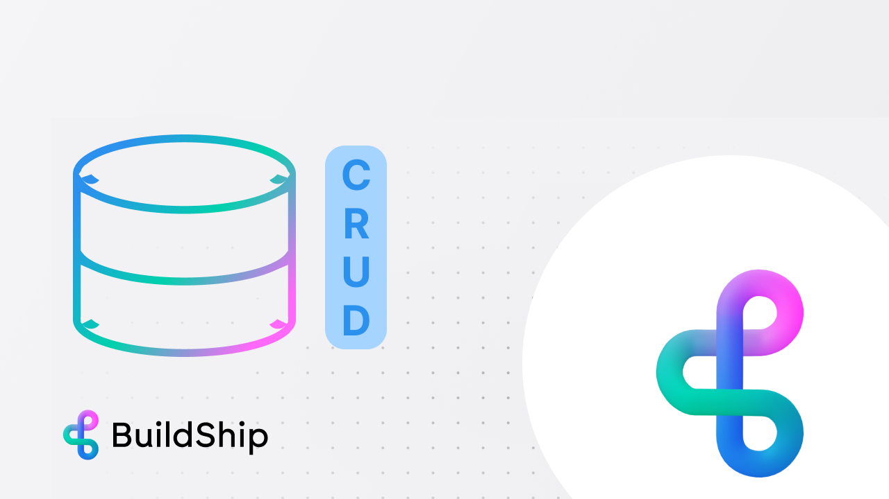
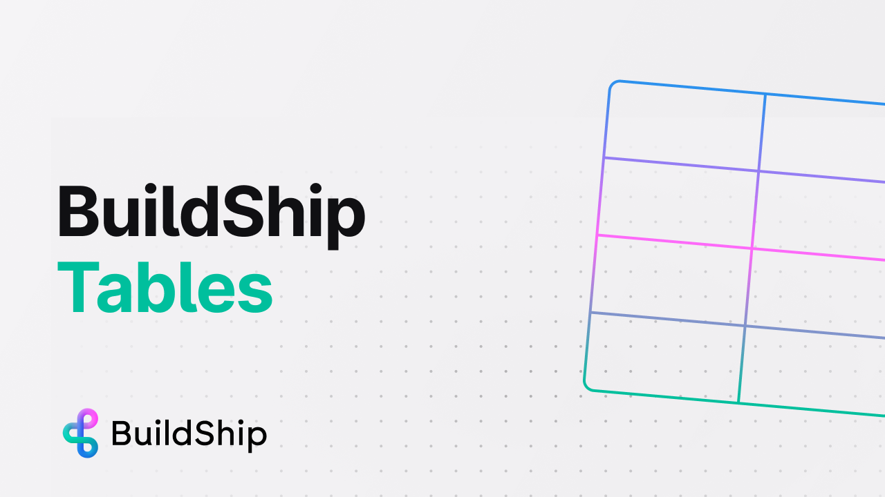

# BuildShip Database

import { Card, Cards } from 'nextra/components';
import { Callout } from 'nextra/components';
import Image from 'next/image';

Every BuildShip Project is equipped with a **built-in Firebase Database and Storage** which can be used to store data.
The BuildShip database is a ready-to-use database and can be easily manipulated using the **BuildShip Database Nodes**.

- **No Additional Setup:** Everything is pre-configured and ready for immediate use.
- **Easy Access:** Users can directly access and interact with the Firestore database through BuildShip.
- **Full Functionality:** You can perform all CRUD (Create, Read, Update, Delete) operations and more, making it a
  comprehensive solution for your Firebase integration needs.

<Callout type='info' emoji='🚀'>
  Use the BuildShip Tables to visualize and manage your BuildShip Firestore data in a Spreadsheet UI. (This feature is
  only available for users on the Pro and Expert plan.)
</Callout>

## Get Started ✅

<Cards num={3}>
  <Card image arrow title='CRUD Operations using Firestore Nodes' href='/database/buildship-db-nodes'>
    <></>
  </Card>
  <Card image arrow title='Visualize and Manage your BuildShip Data' href='/basics/buildship-tables'>
    <></>
  </Card>
</Cards>
