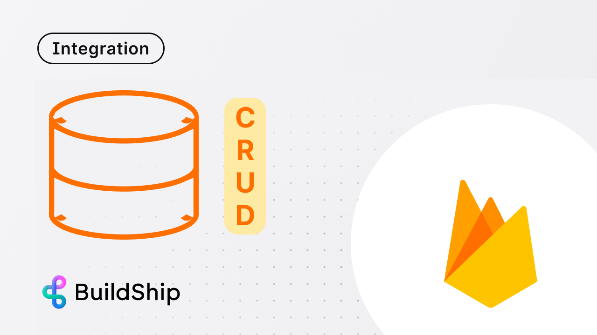

# Firestore Database

import { Card, Cards } from 'nextra/components';
import Image from 'next/image';

The Firestore Integration in BuildShip allows users to interact seamlessly with their own firebase projects, performing
a range of CRUD operations.

## Get Started ✅

<Cards num={3}>
  <Card
    image
    arrow
    title='How to connect BuildShip to your Firebase Project'
    href='/tutorials/firebase-project#option-2-connecting-to-your-own-firebase-project'
  >
    <></>
  </Card>
  <Card image arrow title='CRUD Operations using Firestore Nodes' href='./firestore-nodes'>
    <></>
  </Card>
  <Card
    image
    arrow
    title='Firestore CRUD with no code - visual workflow builder'
    href='https://www.youtube.com/watch?v=9-RCaOhz_eE'
    target='_blank'
  >
    <></>
  </Card>
</Cards>
