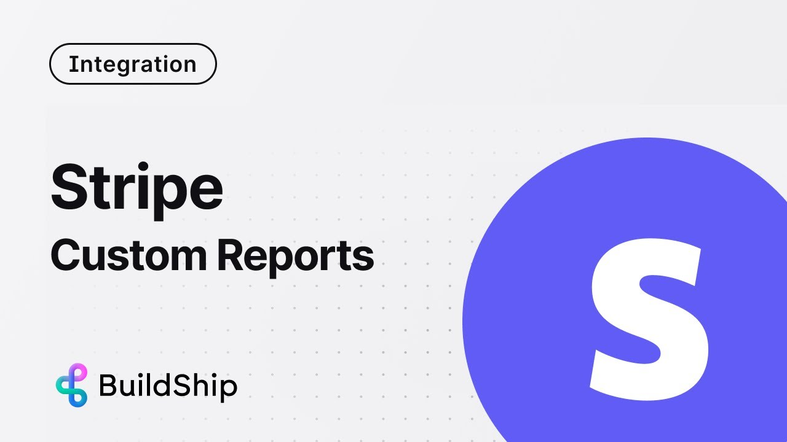
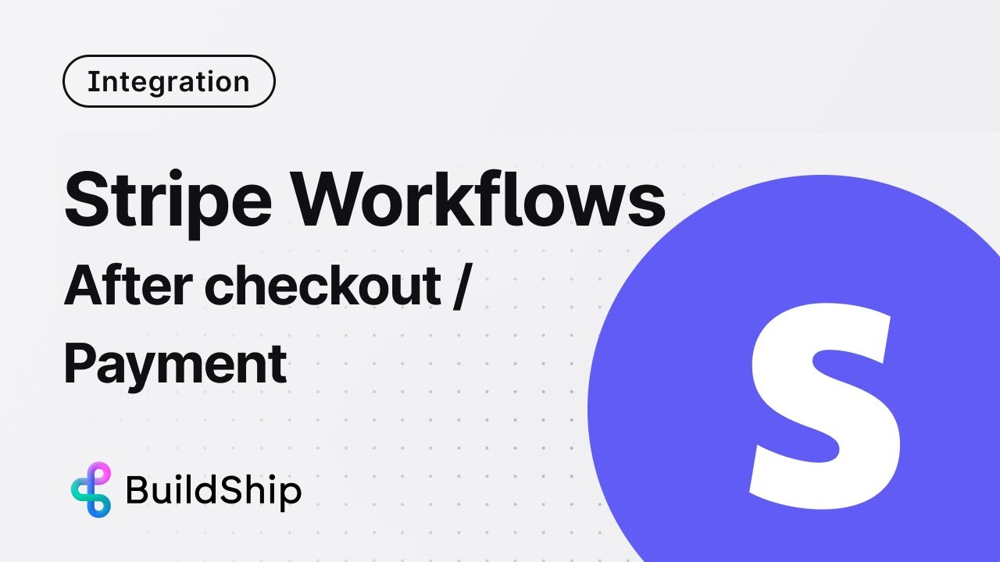

# Stripe Integration

import { Card, Cards } from 'nextra/components';
import { Steps } from 'nextra/components';
import { Callout } from 'nextra/components';
import Image from 'next/image';
import stripe1 from '/public/assets/stripe1.png';
import stripe2 from '/public/assets/stripe2.png';
import stripe3 from '/public/assets/stripe3.png';

The Stripe Integration in BuildShip empowers users to easily interact with their Stripe accounts, leveraging Stripe APIs
to perform a diverse range of operations, all without writing code.

## Getting Started ✅

<Cards num={3}>
  <Card image title='Stripe events saved to postgreSQL database' href='https://youtu.be/FpJjK-TEU8Y?feature=shared'>
    <></>
  </Card>
<Card image title='Generate Custom Stripe Reports' href='https://youtu.be/W21AckYaF7w?feature=shared'>
  <></>
</Card>

  <Card image title='Build a Stripe Checkout / Post Payment Workflow - with no code' href='https://youtu.be/4Xu6ClRcmeI?feature=shared'>
    <></>
  </Card>
</Cards>

## Stripe Trigger

The Stripe Trigger establishes a connection with your Stripe account, triggering workflows in response to specific
webhook events. This functionality allows real-time updates based on various activities within your Stripe Account.

<Image src={stripe1} alt='Stripe Trigger' width={1200} />

To enable the Stripe Trigger, users need to input the following information:

<Steps>
### Stripe Secret Key

The Stripe Secret Key is a unique identifier that allows BuildShip to connect to your Stripe account. To find your
Stripe Secret Key, navigate to the [Stripe Dashboard](https://dashboard.stripe.com/test/apikeys) and copy the **Secret
Key**.

<Callout emoji='💡' type='info'>
  Learn more about Stripe Secret Keys [here](https://stripe.com/docs/keys).
</Callout>

### Stripe Events

Select from a list of specific events or leave it empty to encompass all events. Some available events include
`charge.captured`, `customer.subscription.updated`, and more shown below.

<Image src={stripe2} alt="Stripe Events" width={1200} />
</Steps>

## Stripe Nodes

<Image src={stripe3} alt='Stripe Events' width={1200} />

Within the BuildShip node library under the Stripe Integration, users have access to specialized nodes designed for
specific Stripe functionalities:

| Nodes                              | Purpose                                                                                                                         |
| ---------------------------------- | ------------------------------------------------------------------------------------------------------------------------------- |
| Create Stripe Checkout Session     | Generates a Stripe checkout session URL, allowing seamless redirection for payment processing                                   |
| Fetch Stripe Customer              | Retrieves comprehensive customer data from the Stripe database, facilitating detailed user analysis and management              |
| Get Stripe Event Metadata          | Fetches metadata linked to a Stripe event, providing structured information like customer ID, subscription ID, and more.        |
| Create Stripe Customer             | Instantiates a new customer profile within Stripe, enabling the creation of user accounts or profiles                           |
| Checkout Session: Line Items       | Retrieves detailed line items from a specific Stripe checkout session, providing insights into purchased items or services      |
| Checkout Session: Customer Details | Gathers detailed customer information from a Stripe checkout session, aiding in personalized service delivery and user insights |
