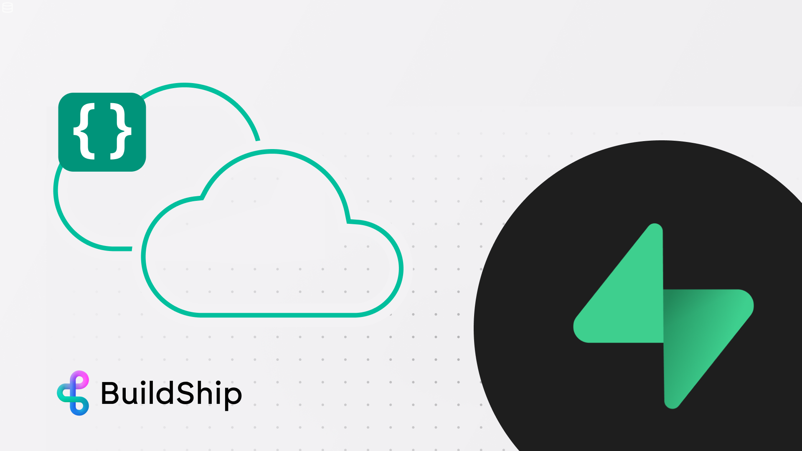
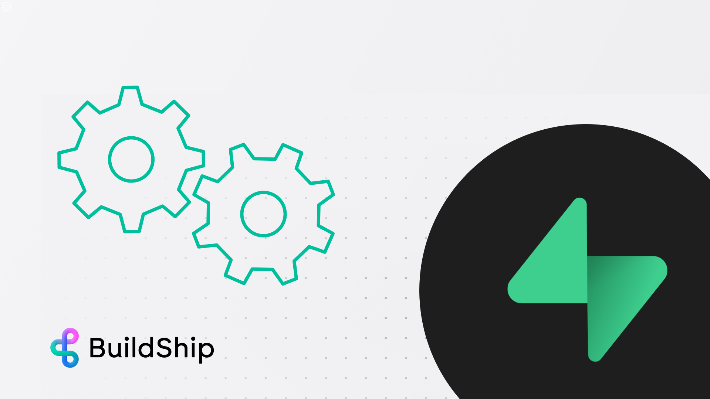
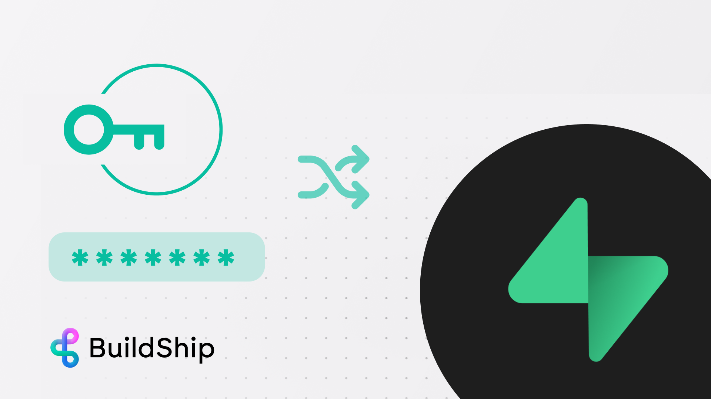
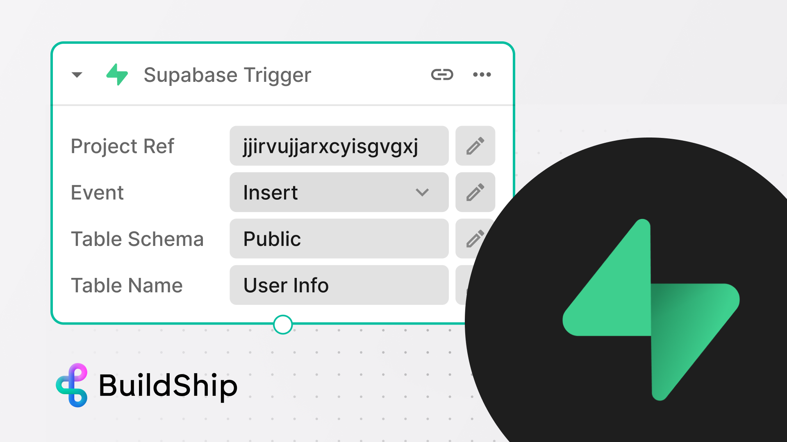

import { Steps } from 'nextra/components';
import { Callout } from 'nextra/components';
import { Card, Cards } from 'nextra/components';
import Image from 'next/image';

# Visually build with Supabase with low-code and AI

This integration allows you to work with Supabase database in low-code/no-code style. Using BuildShip, you can connect
to your Supabase database easily and **build APIs, scheduled jobs and any backend workflow automation or cloud
functions** on top of your Supabase database - without the need to code.

You can use 100s of prebuilt nodes, templates and connectors to popular tools and AI models like **Replicate**,
**OpenAI**, **HuggingFace**, **StabilityAI**, **ElevenLabs** etc. If any integration is missing, you can simply ask AI
and it will generate one for you right from BuildShip's UI! 🪄

## Get Started ✅

<Cards num={3}>
  <Card
    image
    arrow
    title='Perform CRUD operations on Supabase database in your workflows'
    href='./tutorials/supabase-crud'
  >
    <></>
  </Card>
  <Card
    image
    arrow
    title='How to build Supabase Cloud Functions with no code'
    href='https://www.youtube.com/watch?v=oUQKbzdajII'
    target='_blank'
  >
    <></>
  </Card>
  <Card
    image
    arrow
    title='Building APIs, CRON / Scheduled Jobs for Supabase visually'
    href='https://www.youtube.com/watch?v=At_uwZbFgG4'
    target='_blank'
  >
    <></>
  </Card>
  <Card
    image
    arrow
    title='Creating a Private API for Supabase using BuildShip'
    href='https://www.youtube.com/watch?v=uhc8732Dpq4'
    target='_blank'
  >
    <></>
  </Card>
  <Card image arrow title='(COMING SOON) Trigger workflows on Supabase events' href='./trigger-nodes/supabase-trigger'>
    <></>
  </Card>
</Cards>

## How to Connect to Supabase

For connecting your Supabase project to BuildShip, all you need is your **Supabase project URL** and **API key**. Learn
more about **connecting your Supabase Project**. Refer to our dedicated guide below on **connecting Supabase with
BuildShip** and performing operations like **Read, Create (or upsert), Update, and Delete** data within your Supabase
database.

<Cards num={1}>
  <Card
    image
    arrow
    title='Perform CRUD operations on Supabase database in your workflows'
    href='./tutorials/supabase-crud'
  >
    <></>
  </Card>
</Cards>

## How to Build Supabase Cloud Functions with no code

Build cloud functions, APIs, scheduled jobs for Supabase with no code. Watch the video below to discover how to:

- **Trigger workflows on Supabase data changes** i.e. anytime a new row of data is created, updated or deleted
- Respond to new user sign-ups through **Supabase Authentication**
- **Schedule actions at specific intervals**: daily, weekly, monthly, or yearly
- Visual creation of functions without writing code
- Access **hundreds of prebuilt nodes** for integration with your Supabase data, including AI models and third-party
  tools
- **Generate function logic with AI** and customize code if needed

<Cards num={1}>
  <Card
    image
    arrow
    title='How to build Supabase Cloud Functions with no code'
    href='https://www.youtube.com/watch?v=oUQKbzdajII'
    target='_blank'
  >
    <></>
  </Card>
</Cards>

<Callout emoji='🙋🏻'>
  Need help? Chat with us and our community of low-code/no-code builders and developers on
  [Discord](https://buildship.com/discord).
</Callout>
