import { Card, Cards } from 'nextra/components';

# Tutorials

Step by step guided tutorial for powerful usecases and examples.

<Cards>
  <ShowcaseCard
    title='Firebase'
    href='./tutorials/firebase-project'
    onClick={() => {
      window?.posthog?.capture?.('button_docs_tutorials_selected', {
        type: 'button_click',
        option_clicked: 'firebase',
      });
    }}
  >
    <>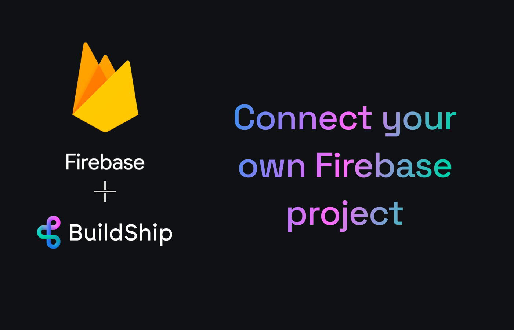</>
  </ShowcaseCard>
  <ShowcaseCard
    title='Firebase Full Text Search'
    href='./tutorials/firebase-full-text-search'
    onClick={() => {
      window?.posthog?.capture?.('button_docs_tutorials_selected', {
        type: 'button_click',
        option_clicked: 'firebase-full-text-search',
      });
    }}
  >
    <>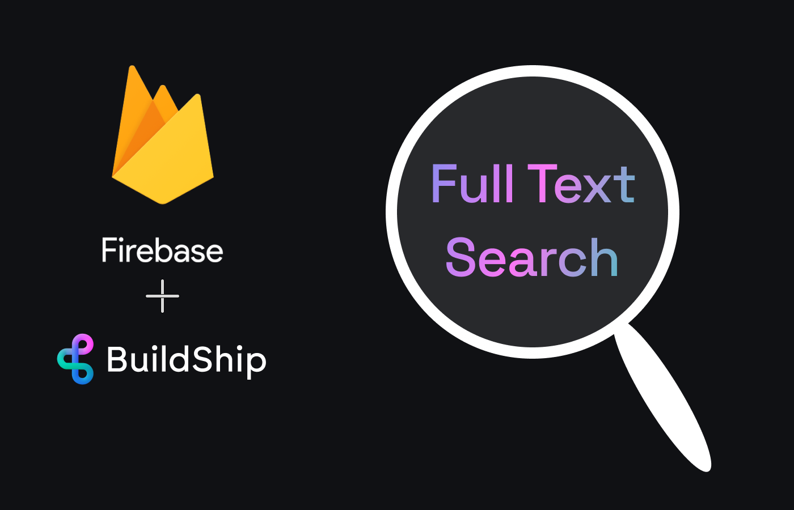</>
  </ShowcaseCard>
  <ShowcaseCard
    title='GCP File Storage'
    href='./tutorials/gcp-storage'
    onClick={() => {
      window?.posthog?.capture?.('button_docs_tutorials_selected', {
        type: 'button_click',
        option_clicked: 'gcp-storage',
      });
    }}
  >
    <>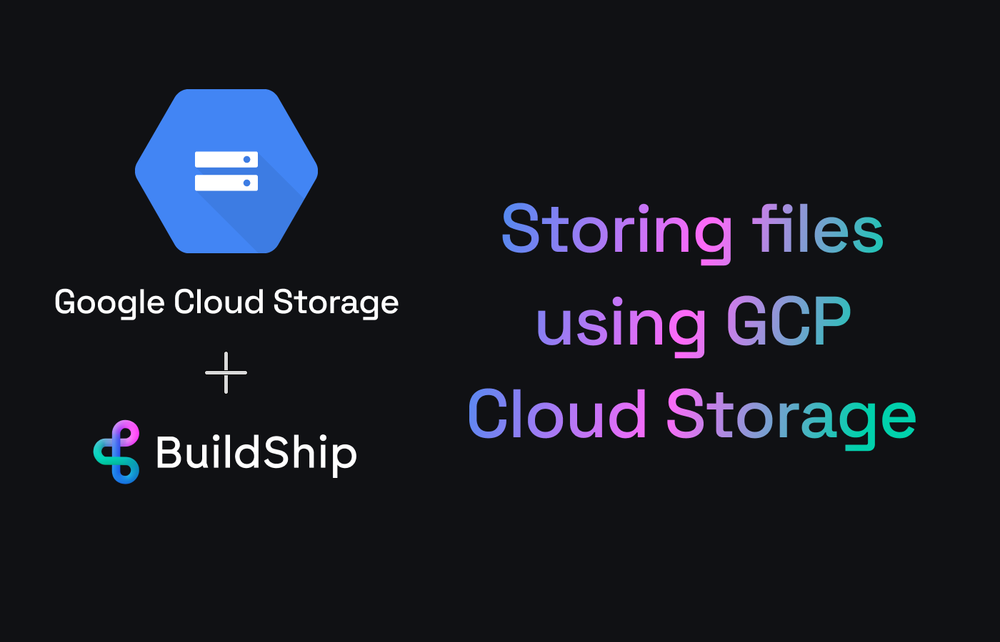</>
  </ShowcaseCard>
  <ShowcaseCard
    title='Supabase'
    href='./tutorials/supabase-crud'
    onClick={() => {
      window?.posthog?.capture?.('button_docs_tutorials_selected', {
        type: 'button_click',
        option_clicked: 'supabase-crud',
      });
    }}
  >
    <>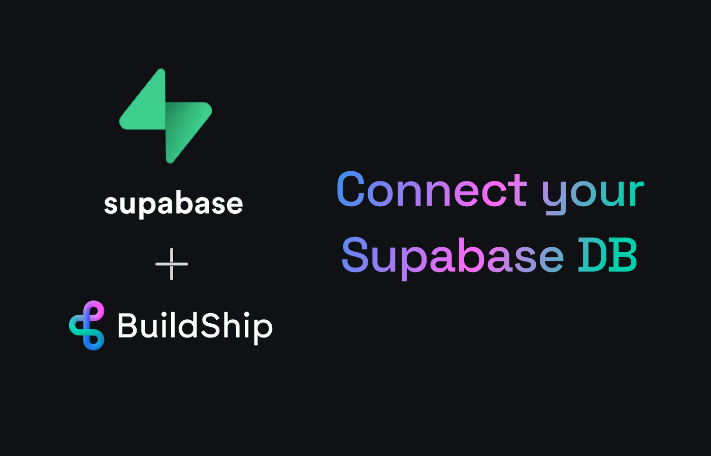</>
  </ShowcaseCard>
  <ShowcaseCard
    title='Postgres'
    href='./tutorials/postgres'
    onClick={() => {
      window?.posthog?.capture?.('button_docs_tutorials_selected', {
        type: 'button_click',
        option_clicked: 'postgres',
      });
    }}
  >
    <>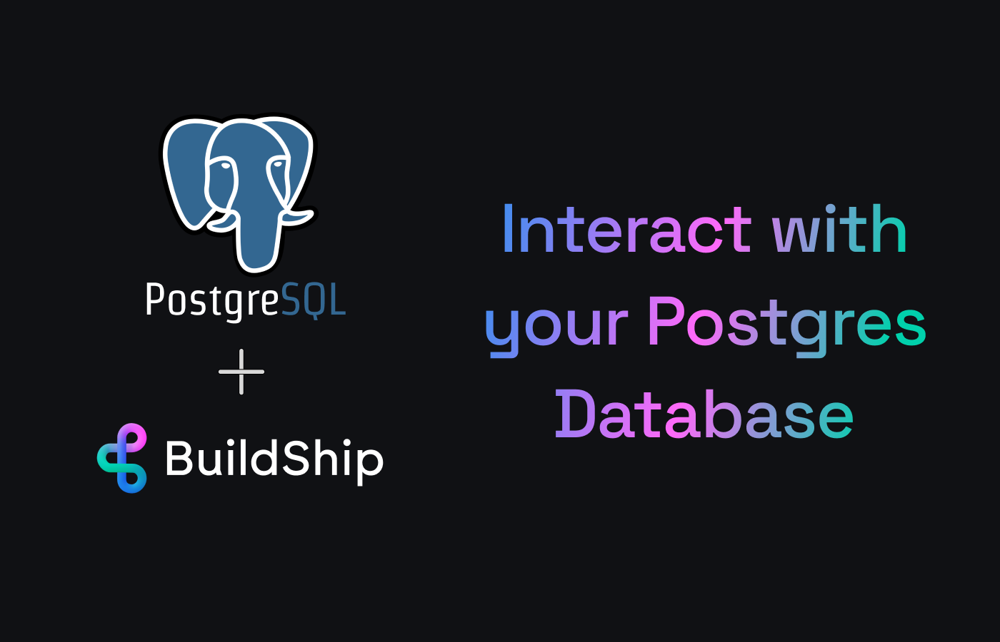</>
  </ShowcaseCard>
  <ShowcaseCard
    title='Bring Your Own Key'
    href='./tutorials/byok'
    onClick={() => {
      window?.posthog?.capture?.('button_docs_tutorials_selected', {
        type: 'button_click',
        option_clicked: 'byok',
      });
    }}
  >
    <></>
  </ShowcaseCard>
  <ShowcaseCard
    title='MySQL'
    href='./tutorials/mysql-crud'
    onClick={() => {
      window?.posthog?.capture?.('button_docs_tutorials_selected', {
        type: 'button_click',
        option_clicked: 'mysql',
      });
    }}
  >
    <>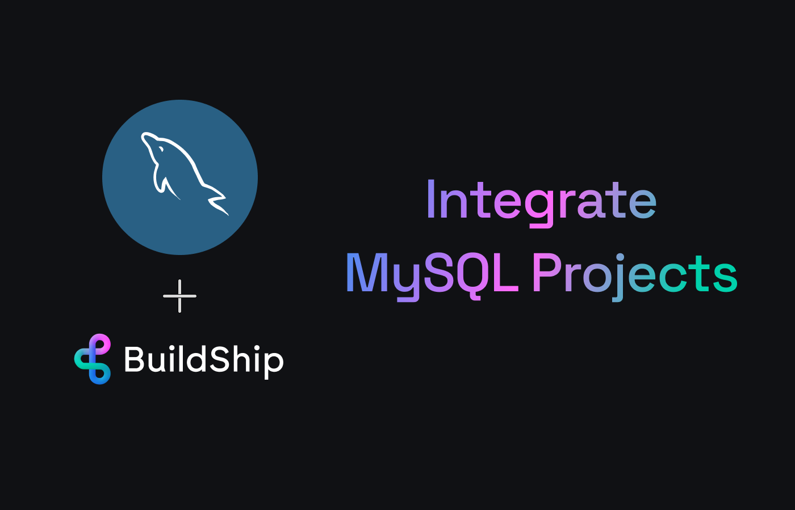</>
  </ShowcaseCard>
  <ShowcaseCard
    title='Secure Your API Endpoint'
    href='./tutorials/secure-api'
    onClick={() => {
      window?.posthog?.capture?.('button_docs_tutorials_selected', {
        type: 'button_click',
        option_clicked: 'secure-api',
      });
    }}
  >
    <>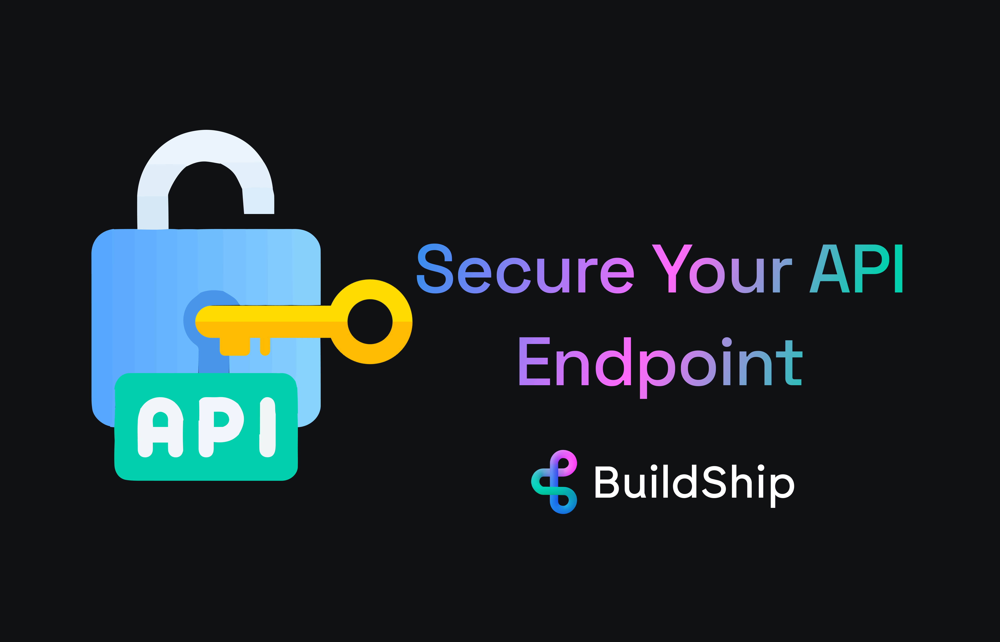</>

  </ShowcaseCard>
    <ShowcaseCard
    title='Notion'
    href='./tutorials/notion-oauth'
    onClick={() => {
      window?.posthog?.capture?.('button_docs_tutorials_selected', {
        type: 'button_click',
        option_clicked: 'notion',
      });
    }}
  >
    <>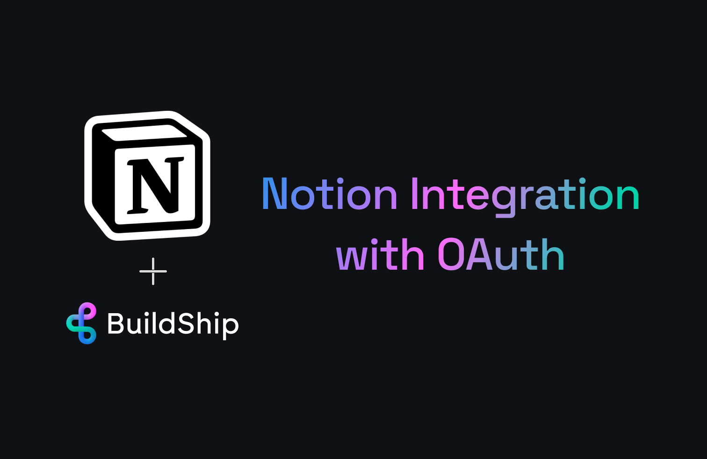</>
  </ShowcaseCard>
  <ShowcaseCard
    title='Vector Database'
    href='./tutorials/vector-applications'
    onClick={() => {
      window?.posthog?.capture?.('button_docs_tutorials_selected', {
        type: 'button_click',
        option_clicked: 'vector-applications',
      });
    }}
  >
    <>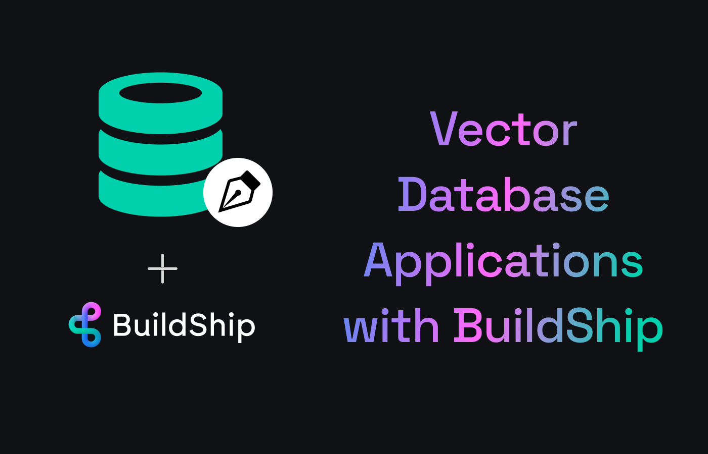</>
  </ShowcaseCard>
  <ShowcaseCard
    title='Supabase Postgres RPC'
    href='./tutorials/supabase-rpc'
    onClick={() => {
      window?.posthog?.capture?.('button_docs_tutorials_selected', {
        type: 'button_click',
        option_clicked: 'supabase-rpc',
      });
    }}
  >
    <>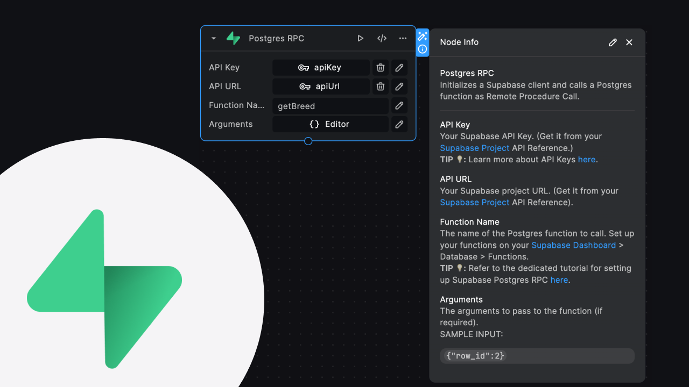</>
  </ShowcaseCard>
    <ShowcaseCard
    title='Supabase Search'
    href='./tutorials/supabase-search'
    onClick={() => {
      window?.posthog?.capture?.('button_docs_tutorials_selected', {
        type: 'button_click',
        option_clicked: 'supabase-search',
      });
    }}
  >
    <>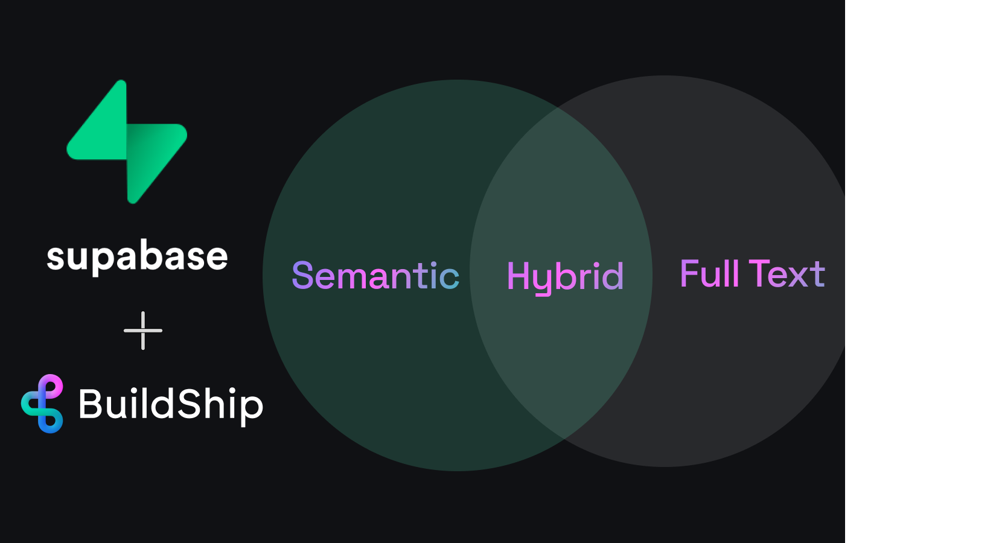</>
  </ShowcaseCard>
  <ShowcaseCard
    title='MongoDB Search'
    href='./tutorials/mongodb-search'
    onClick={() => {
      window?.posthog?.capture?.('button_docs_tutorials_selected', {
        type: 'button_click',
        option_clicked: 'mongodb-search',
      });
    }}
  >
    <>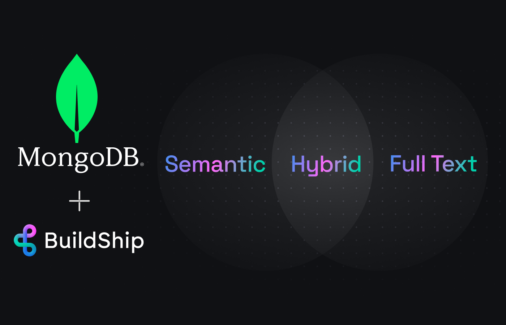</>
  </ShowcaseCard>
    <ShowcaseCard
    title='RAG with Buildship'
    href='./tutorials/rag'
    onClick={() => {
      window?.posthog?.capture?.('button_docs_tutorials_selected', {
        type: 'button_click',
        option_clicked: 'rag',
      });
    }}
  >
    <>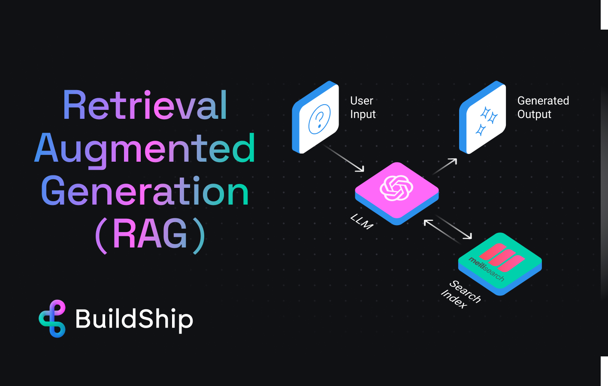</>
  </ShowcaseCard>
</Cards>

export const ShowcaseCard = Object.assign(
  // Copy card component and add default props
  Card.bind(),
  {
    displayName: 'ShowcaseCard',
    defaultProps: {
      image: true,
      arrow: true,
      target: '_self',
    },
  },
);

