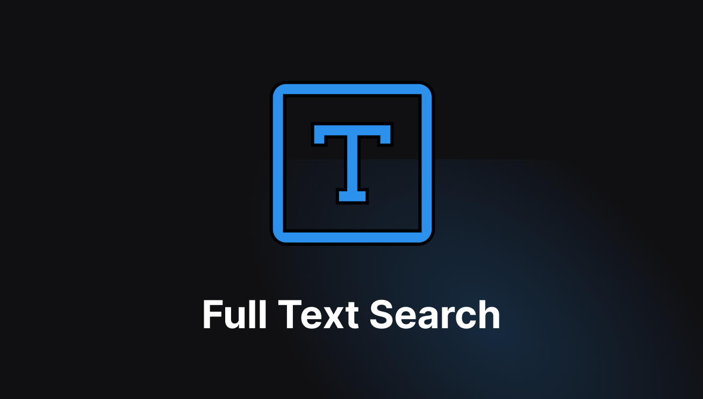
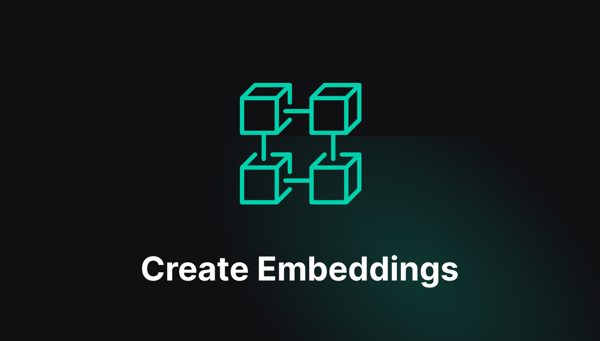
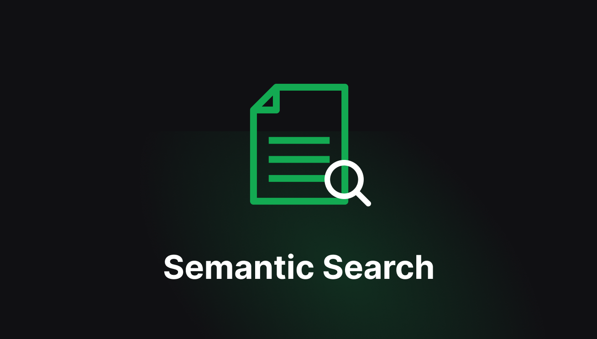
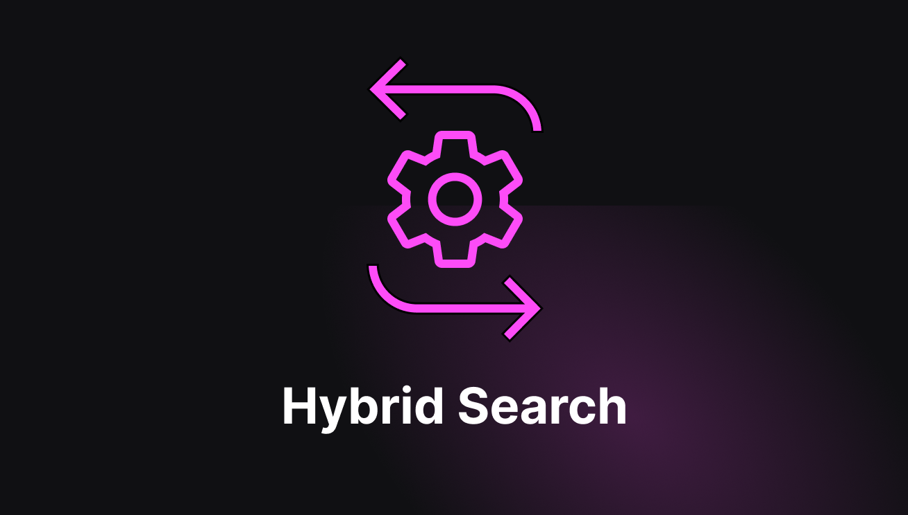

import { Steps } from 'nextra/components';
import { Callout } from 'nextra/components';
import { Card, Cards } from 'nextra/components';
import Image from 'next/image';
import mongodbOg from '/public/assets/mongodbsearch.png';
import mongo3 from '/public/assets/mongo-3.png';
import mongo4 from '/public/assets/mongo-4.png';
import mongo5 from '/public/assets/mongo-5.png';
import mongo6 from '/public/assets/mongo-6.png';
import mongo7 from '/public/assets/mongo-7.png';
import mongo11 from '/public/assets/mongo-11.png';

# MongoDB Search Integration

The MongoDB Search Integration in BuildShip enables users to leverage MongoDB for their advanced search and indexing
needs through a streamlined, low-code interface. MongoDB offers powerful full-text search, vector search, and hybrid
search capabilities, making it possible to build highly relevant and sophisticated search experiences within your
applications and websites.

<br />
<Image src={mongodbOg} alt='MongoDB' width={1200} />

BuildShip's MongoDB Search Nodes enable easy connection to MongoDB instances, allowing the creation of APIs, scheduled
jobs, and search-centric workflows.

These MongoDB Search Nodes offer a no-code interface for advanced search features, simplifying tasks such as indexing
documents, adjusting settings, and performing complex queries. This makes managing search functionalities efficient and
accessible within the intuitive BuildShip environment.

## Get Started ✅

<Cards num={3}>
  <Card
    image
    arrow
    title='Full Text Search: Quick and Efficient Document Retrieval'
    href='/tutorials/mongodb-search#full-text-search'
  >
    <></>
  </Card>
  <Card
    image
    arrow
    title='Creating Embeddings: Laying the Groundwork for Advanced Searches'
    href='/tutorials/mongodb-search#creating-embeddings'
  >
    <></>
  </Card>
  <Card
    image
    arrow
    title='Semantic Search: Finding Meaning in Your Data'
    href='/tutorials/mongodb-search#semantic-search'
  >
    <></>
  </Card>
  <Card
    image
    arrow
    title='Hybrid Search: Combining Power of Semantic and Full Text Search'
    href='/tutorials/mongodb-search#hybrid-search'
  >
    <></>
  </Card>
</Cards>

## Prerequisites ✅

Before you can start using the MongoDB Search Nodes in BuildShip, ensure that you have the following prerequisites in
place:

### MongoDB Atlas Project

You'll need access to a MongoDB Atlas project. Follow these steps to prepare your account and initiate your first
project:

1. Navigate to [MongoDB Atlas](https://www.mongodb.com/cloud/atlas) to either sign up for a new account or log in if you
   are an existing user.
2. Create a new project and configure your database, including adding sample data if needed.

For detailed instructions on setting up your MongoDB Atlas project and integrating it with BuildShip, please refer to
[BuildShip X MongoDB docs](https://docs.buildship.com/database/mongodb#database).

## Full Text Search

You must configure an Atlas Search index to query data in your Atlas cluster using MongoDB Full Text Search node. Atlas
Search indexes enable faster retrieval of documents using certain identifiers. The "Full Text Search" node allows you to
perform full-text searches on a MongoDB collection, enabling you to find documents that match a specific search query.

To set up MongoDB full text search in your BuildShip workflow, you first need to create a Search index

### Create an Atlas Search index

<br />

<Image src={mongo4} alt='mongodb' width={1200} />

1. In Atlas, go to the Clusters page for your project.
2. Go to the Atlas Search page for your cluster.
3. Select Atlas Search Visual Editor under Atlas Search Configuration Method and click Next
4. Enter the Index Name (`fts`), and set the Database and Collection.
5. Click Create Search Index.

<Callout>
  The index should be created with the name `fts` if you don't want to change the `Index Name` in the node. You can
  create this index using the Atlas UI. Alternatively, you can create it using the Atlas Search API and Atlas CLI. You
  can find detailed documentation of this in this
  [guide](https://www.mongodb.com/docs/atlas/atlas-search/tutorial/create-index/#in---go-to-the-clusters-page-for-your-project).
</Callout>

### Use the Full Text Search node to perform the search.

<Image src={mongo3} alt='mongodb' width={1200} />

#### Inputs

- **Connection String**: The MongoDB connection string.
- **Database**: The name of the database.
- **Collection**: The name of the column in the specified table where the full-text search will be conducted.
- **Query**: The search query string that you want to use for finding matching documents.
- **Index Name**: (Optional) The number of results to return. Default is 10.

#### Output

The node returns an object with the following properties:

```json
{
  "success": boolean,
  "count": integer,
  "documents": [
    {
      "document": object
    }
  ]
}
```

- `success` : A boolean value indicating the success of the operation.
- `count` : The number of documents returned by the search query.
- `results` : An array of documents resulting from the search query.

## Creating Embeddings

To perform semantic search and hybrid search in MongoDB, you need to create embeddings for your documents. These
embeddings represent your data as points in multi-dimensional space, capturing meaningful relationships and enabling
tasks such as semantic search and retrieval. You can store vector embeddings along with your other data in MongoDB Atlas
and use Atlas Vector Search to query your vectorized data. For detailed documentation on create embeddings refer to this
[guide](https://www.mongodb.com/docs/atlas/atlas-vector-search/create-embeddings/)

To create embeddings for your MongoDB Collection, follow these steps:

<Steps>

### Generate Embeddings with OpenAI

Use the Buildship OpenAI Generate Embeddings Node to create embeddings for each document's content.

### Retrieve Collection Documents

Use the `Query Collection` node to retrieve all the documents from the collection with the specified fields. In this
case, you only need the `_id` and `content` of each document.

### Update Embedding Column

For each document, update the new `embedding` field value using the `Generate Embeddings` node and MongoDB
`Update Document` node enclosed in a `Repeat` node.

</Steps>

For a streamlined implementation, you can use this
[Remix template](https://buildship.app/remix?template=mongodb-create-embeddings) as shown in the image below:

<Image src={mongo5} alt='mongodb' width={1200} />

<Callout>This step is **necessary** for performing semantic searches and hybrid searches later.</Callout>

## Semantic Search

To query data in your Atlas cluster using the MongoDB Full Text Search node, you must first configure an Atlas Search index. These indexes enable faster document retrieval using specific identifiers. The "Full Text Search" node allows you to perform full-text searches on a MongoDB collection, making it easy to find documents that match a given search query.

To set up MongoDB full text search in your BuildShip workflow, let's first create a Search index

### Create an Atlas Vector Search Index

<br />

<Image src={mongo7} alt='mongodb' width={1200} />

1. In your project, go to the Clusters page. 
2. Go to the Atlas Search page for your cluster.
3. Select JSON Editor under Atlas Vector Search Method and click Next
4. Enter the Index Name (`vector_index`), and set the Database and Collection.

```json
{
  "fields": [
    {
      "type": "vector",
      "path": "embedding",
      "numDimensions": 1536,
      "similarity": "euclidean"
    }
  ]
}
```

- `type` : Indicates the field type, set to `"vector"` for vector embeddings.
- `path` : Path to the field containing vector embeddings.
- `count` : Number of dimensions in the vectors (use 1536 if using OpenAI embeddings).
- `results` : Function for comparing vectors (`"euclidean"`, `"cosine"`, or `"dotProduct"`).

5. Click Create Search Index.

<Callout>
  The index should be created with the name `vector_index` if you don't want to change the `Index Name` in the node. You
  can create this index using the Atlas UI. Alternatively, you can create it using the Atlas Search API and Atlas CLI.
  You can find detailed documentation of this in this
  [guide](https://www.mongodb.com/docs/atlas/atlas-vector-search/vector-search-type/).
</Callout>

### Use the Semantic Search node to perform the search.

<Image src={mongo6} alt='mongodb' width={1200} />

#### Inputs

- **Connection String**: The MongoDB connection string.
- **Database**: The name of the database.
- **Collection**: The name of the column in the specified table where the full-text search will be conducted.
- **Query**: The search query string that you want to use for finding matching documents.
- **Index Name**: The name of the vector search index.
- **Candidates**: (Optional) The number of candidate results to consider. Default is 150.
- **Limit**: (Optional) The maximum number of results to return. Default is 10.

#### Output

The node returns an object with the following properties:

```json
{
  "success": boolean,
  "count": integer,
  "documents": [
    {
      "document": object
    }
  ]
}
```

- `success` : A boolean value indicating the success of the operation.
- `count` : The number of documents returned by the search query.
- `results` : An array of documents resulting from the search query.

## Hybrid Search

Hybrid Search combines the power of semantic search and full-text search, using both Atlas Vector Search and Atlas Full-Text Search to provide comprehensive search results. This method combines the semantic similarity of documents with the exact match capabilities of full-text search.

To set up MongoDB hybrid search in your workflow, you first need to create both Atlas Search Index and Atlas Vector
Search index. Refer to the below sections to create the indexes:

- `fts` : [Atlas Search Index](https://docs.buildship.com//tutorials/mongodb-search#create-an-atlas-search-index)
- `vector_index` :
  [Atlas Vector Search Index](https://docs.buildship.com//tutorials/mongodb-search#create-an-atlas-vector-search-index)

<Callout>
  Make sure to create the indexes with the names `fts` and `vector_index` to avoid changing the Index Names in the node.
</Callout>

<Image src={mongo11} alt='mongodb' width={1200} />

#### Inputs

- **Connection String**: The MongoDB connection string.
- **Database**: The name of the database.
- **Collection**: The name of the column in the specified table where the full-text search will be conducted.
- **Query**: The search query string that you want to use for finding matching documents.
- **Vector Index Name**: The name of the vector search index.
- **Full-Text Index Name**: The name of the full-text search index.
- **Candidates**: (Optional) The number of candidate results to consider. Default is 150.
- **Limit**: (Optional) The maximum number of results to return. Default is 10.

#### Output

The node returns an object with the following properties:

```json
{
  "success": boolean,
  "count": integer,
  "documents": [
    {
      "document": object
    }
  ]
}
```

- `success` : A boolean value indicating the success of the operation.
- `count` : The number of documents returned by the search query.
- `results` : An array of documents resulting from the search query.

<Callout>
  This node combines the results of both semantic and full-text searches using reciprocal rank fusion to provide a
  comprehensive set of results.
</Callout>
